# Temple Management System - Project Flowcharts

## Overview
This document contains comprehensive flowcharts for the Temple Management System, covering the full application architecture from frontend to backend.

## System Architecture Flow

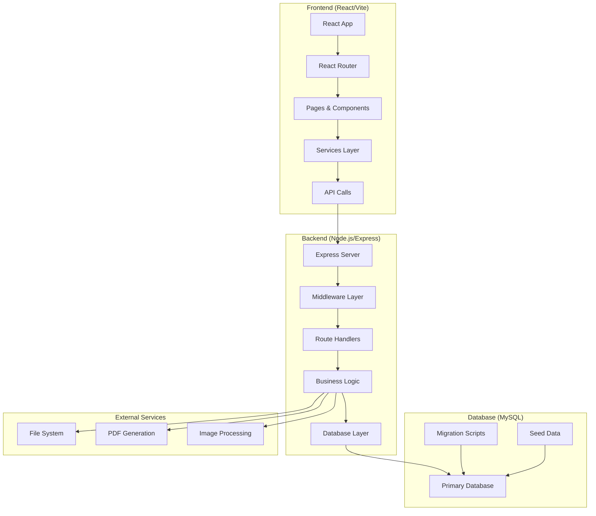
```mermaid
graph TB
    subgraph "Frontend (React/Vite)"
        A[React App] --> B[React Router]
        B --> C[Pages & Components]
        C --> D[Services Layer]
        D --> E[API Calls]
    end
    
    subgraph "Backend (Node.js/Express)"
        F[Express Server] --> G[Middleware Layer]
        G --> H[Route Handlers]
        H --> I[Business Logic]
        I --> J[Database Layer]
    end
    
    subgraph "Database (MySQL)"
        K[Primary Database]
        L[Migration Scripts]
        M[Seed Data]
    end
    
    E --> F
    J --> K
    L --> K
    M --> K
    
    subgraph "External Services"
        N[File System]
        O[PDF Generation]
        P[Image Processing]
    end
    
    I --> N
    I --> O
    I --> P
```

## Authentication Flow

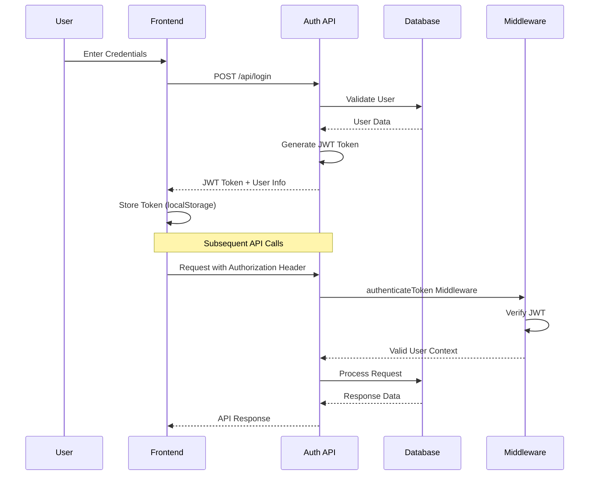
```mermaid
sequenceDiagram
    participant U as User
    participant F as Frontend
    participant A as Auth API
    participant D as Database
    participant M as Middleware
    
    U->>F: Enter Credentials
    F->>A: POST /api/login
    A->>D: Validate User
    D-->>A: User Data
    A->>A: Generate JWT Token
    A-->>F: JWT Token + User Info
    F->>F: Store Token (localStorage)
    
    Note over F,A: Subsequent API Calls
    F->>A: Request with Authorization Header
    A->>M: authenticateToken Middleware
    M->>M: Verify JWT
    M-->>A: Valid User Context
    A->>D: Process Request
    D-->>A: Response Data
    A-->>F: API Response
```

## User Registration Flow

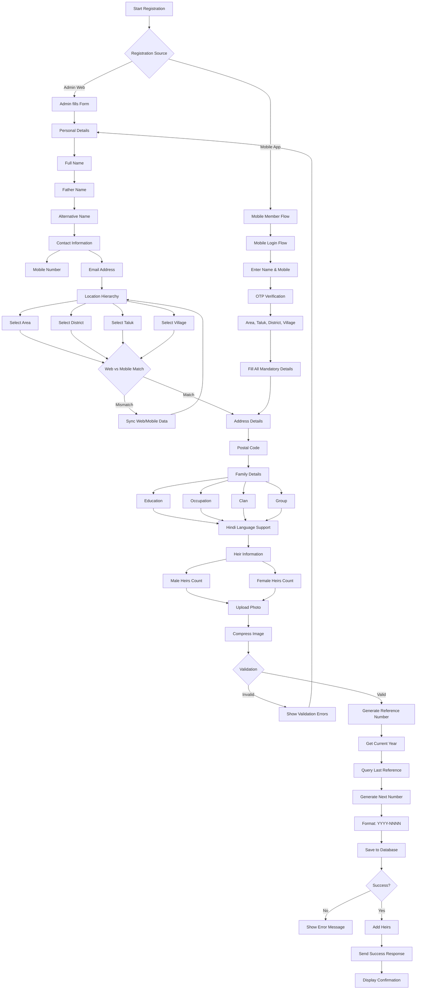
```mermaid
flowchart TD
    A[Start Registration] --> B{Registration Source}
    
    B -->|Admin Web| C[Admin fills Form]
    B -->|Mobile App| D[Mobile Member Flow]
    
    C --> E[Personal Details]
    E --> F[Full Name]
    F --> G[Father Name]
    G --> H[Alternative Name]
    
    H --> I[Contact Information]
    I --> J[Mobile Number]
    I --> K[Email Address]
    
    K --> L[Location Hierarchy]
    L --> M[Select Area]
    L --> N[Select District]
    L --> O[Select Taluk]
    L --> P[Select Village]
    
    M --> Q{Web vs Mobile Match}
    N --> Q
    O --> Q
    P --> Q
    
    Q -->|Mismatch| R[Sync Web/Mobile Data]
    Q -->|Match| S[Address Details]
    
    D --> T[Mobile Login Flow]
    T --> U[Enter Name & Mobile]
    U --> V[OTP Verification]
    V --> W[Area, Taluk, District, Village]
    W --> X[Fill All Mandatory Details]
    X --> S
    
    S --> Y[Postal Code]
    Y --> Z[Family Details]
    
    Z --> AA[Education]
    Z --> AB[Occupation]
    Z --> AC[Clan]
    Z --> AD[Group]
    
    AA --> AE[Hindi Language Support]
    AB --> AE
    AC --> AE
    AD --> AE
    
    AE --> AF[Heir Information]
    AF --> AG[Male Heirs Count]
    AF --> AH[Female Heirs Count]
    
    AG --> AI[Upload Photo]
    AH --> AI
    AI --> AJ[Compress Image]
    
    AJ --> AK{Validation}
    AK -->|Invalid| AL[Show Validation Errors]
    AK -->|Valid| AM[Generate Reference Number]
    
    AM --> AN[Get Current Year]
    AN --> AO[Query Last Reference]
    AO --> AP[Generate Next Number]
    AP --> AQ[Format: YYYY-NNNN]
    
    AQ --> AR[Save to Database]
    AR --> AS{Success?}
    
    AS -->|No| AT[Show Error Message]
    AS -->|Yes| AU[Add Heirs]
    AU --> AV[Send Success Response]
    AV --> AW[Display Confirmation]
    
    AL --> E
    R --> L
```

## Ledger Management System Flow

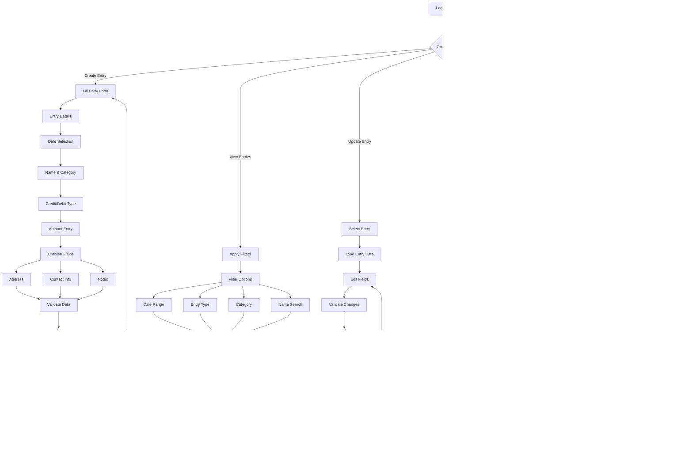
```mermaid
flowchart TD
    A[Ledger Request] --> B{Operation Type}
    
    B -->|Create Entry| C[Fill Entry Form]
    B -->|View Entries| D[Apply Filters]
    B -->|Update Entry| E[Select Entry]
    B -->|Delete Entry| F[Select Entry]
    B -->|Get Balance| G[Calculate Balance]
    B -->|Profit & Loss| H[Generate Report]
    
    C --> I[Entry Details]
    I --> J[Date Selection]
    J --> K[Name & Category]
    K --> L[Credit/Debit Type]
    L --> M[Amount Entry]
    M --> N[Optional Fields]
    
    N --> O[Address]
    N --> P[Contact Info]
    N --> Q[Notes]
    
    O --> R[Validate Data]
    P --> R
    Q --> R
    
    R --> S{Valid?}
    S -->|No| T[Show Errors]
    S -->|Yes| U[Save to Database]
    U --> V[Create Log Entry]
    V --> W[Return Success]
    
    D --> X[Filter Options]
    X --> Y[Date Range]
    X --> Z[Entry Type]
    X --> AA[Category]
    X --> AB[Name Search]
    
    Y --> AC[Build Query]
    Z --> AC
    AA --> AC
    AB --> AC
    
    AC --> AD[Execute Query]
    AD --> AE[Apply Pagination]
    AE --> AF[Return Results]
    
    E --> AG[Load Entry Data]
    AG --> AH[Edit Fields]
    AH --> AI[Validate Changes]
    AI --> AJ{Valid?}
    AJ -->|No| AK[Show Errors]
    AJ -->|Yes| AL[Update Database]
    AL --> AM[Log Changes]
    AM --> AN[Return Updated Entry]
    
    F --> AO[Confirm Deletion]
    AO --> AP{Confirmed?}
    AP -->|No| AQ[Cancel]
    AP -->|Yes| AR[Delete Entry]
    AR --> AS[Log Deletion]
    AS --> AT[Return Success]
    
    G --> AU[Query All Entries]
    AU --> AV[Sum Credits]
    AU --> AW[Sum Debits]
    AV --> AX[Calculate: Credits - Debits]
    AW --> AX
    AX --> AY[Return Balance]
    
    H --> AZ[Query Entries]
    AZ --> BA[Group by Period]
    BA --> BB[Calculate Totals]
    BB --> BC[Generate Report]
    BC --> BD[Return P&L Data]
    
    W --> BE[Complete]
    AF --> BE
    AN --> BE
    AT --> BE
    AY --> BE
    BD --> BE
    T --> C
    AK --> AH
```

## Ledger CRUD Operations Flow

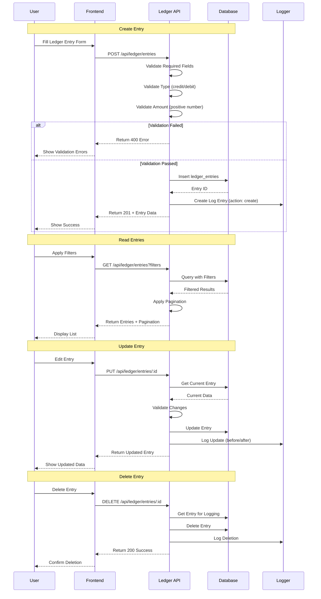
```mermaid
sequenceDiagram
    participant U as User
    participant F as Frontend
    participant API as Ledger API
    participant DB as Database
    participant L as Logger
    
    Note over U,DB: Create Entry
    U->>F: Fill Ledger Entry Form
    F->>API: POST /api/ledger/entries
    API->>API: Validate Required Fields
    API->>API: Validate Type (credit/debit)
    API->>API: Validate Amount (positive number)
    
    alt Validation Failed
        API-->>F: Return 400 Error
        F-->>U: Show Validation Errors
    else Validation Passed
        API->>DB: Insert ledger_entries
        DB-->>API: Entry ID
        API->>L: Create Log Entry (action: create)
        API-->>F: Return 201 + Entry Data
        F-->>U: Show Success
    end
    
    Note over U,DB: Read Entries
    U->>F: Apply Filters
    F->>API: GET /api/ledger/entries?filters
    API->>DB: Query with Filters
    DB-->>API: Filtered Results
    API->>API: Apply Pagination
    API-->>F: Return Entries + Pagination
    F-->>U: Display List
    
    Note over U,DB: Update Entry
    U->>F: Edit Entry
    F->>API: PUT /api/ledger/entries/:id
    API->>DB: Get Current Entry
    DB-->>API: Current Data
    API->>API: Validate Changes
    API->>DB: Update Entry
    API->>L: Log Update (before/after)
    API-->>F: Return Updated Entry
    F-->>U: Show Updated Data
    
    Note over U,DB: Delete Entry
    U->>F: Delete Entry
    F->>API: DELETE /api/ledger/entries/:id
    API->>DB: Get Entry for Logging
    API->>DB: Delete Entry
    API->>L: Log Deletion
    API-->>F: Return 200 Success
    F-->>U: Confirm Deletion
```

## Ledger Balance Calculation Flow

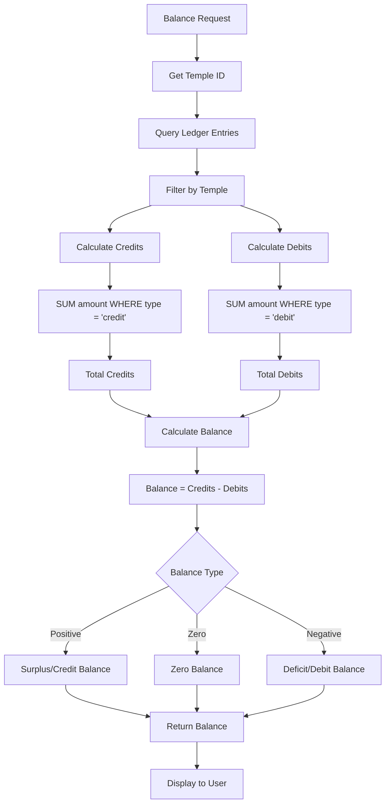
```mermaid
flowchart TD
    A[Balance Request] --> B[Get Temple ID]
    B --> C[Query Ledger Entries]
    
    C --> D[Filter by Temple]
    D --> E[Calculate Credits]
    D --> F[Calculate Debits]
    
    E --> G[SUM amount WHERE type = 'credit']
    F --> H[SUM amount WHERE type = 'debit']
    
    G --> I[Total Credits]
    H --> J[Total Debits]
    
    I --> K[Calculate Balance]
    J --> K
    K --> L[Balance = Credits - Debits]
    
    L --> M{Balance Type}
    M -->|Positive| N[Surplus/Credit Balance]
    M -->|Zero| O[Zero Balance]
    M -->|Negative| P[Deficit/Debit Balance]
    
    N --> Q[Return Balance]
    O --> Q
    P --> Q
    
    Q --> R[Display to User]
```

## Ledger Journal Integration Flow

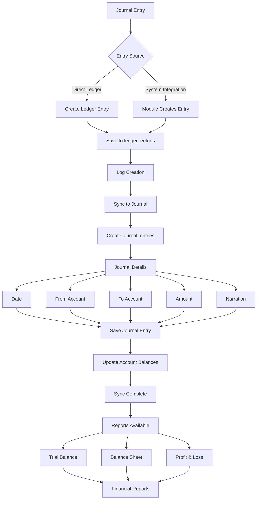
```mermaid
flowchart TD
    A[Journal Entry] --> B{Entry Source}
    
    B -->|Direct Ledger| C[Create Ledger Entry]
    B -->|System Integration| D[Module Creates Entry]
    
    C --> E[Save to ledger_entries]
    D --> E
    
    E --> F[Log Creation]
    
    F --> G[Sync to Journal]
    G --> H[Create journal_entries]
    
    H --> I[Journal Details]
    I --> J[Date]
    I --> K[From Account]
    I --> L[To Account]
    I --> M[Amount]
    I --> N[Narration]
    
    J --> O[Save Journal Entry]
    K --> O
    L --> O
    M --> O
    N --> O
    
    O --> P[Update Account Balances]
    P --> Q[Sync Complete]
    
    Q --> R[Reports Available]
    R --> S[Trial Balance]
    R --> T[Balance Sheet]
    R --> U[Profit & Loss]
    
    S --> V[Financial Reports]
    T --> V
    U --> V
```

## Ledger Data Architecture

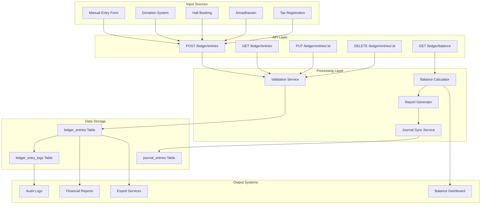
```mermaid
graph TB
    subgraph "Input Sources"
        A[Manual Entry Form]
        B[Donation System]
        C[Hall Booking]
        D[Annadhanam]
        E[Tax Registration]
    end
    
    subgraph "API Layer"
        F[POST /ledger/entries]
        G[GET /ledger/entries]
        H[PUT /ledger/entries/:id]
        I[DELETE /ledger/entries/:id]
        J[GET /ledger/balance]
    end
    
    subgraph "Processing Layer"
        K[Validation Service]
        L[Balance Calculator]
        M[Report Generator]
        N[Journal Sync Service]
    end
    
    subgraph "Data Storage"
        O[ledger_entries Table]
        P[ledger_entry_logs Table]
        Q[journal_entries Table]
    end
    
    subgraph "Output Systems"
        R[Financial Reports]
        S[Balance Dashboard]
        T[Audit Logs]
        U[Export Services]
    end
    
    A --> F
    B --> F
    C --> F
    D --> F
    E --> F
    
    F --> K
    G --> K
    H --> K
    I --> K
    J --> L
    
    K --> O
    L --> M
    M --> N
    N --> Q
    
    O --> P
    O --> R
    L --> S
    P --> T
    O --> U
```

## Ledger Reports & Analytics Flow

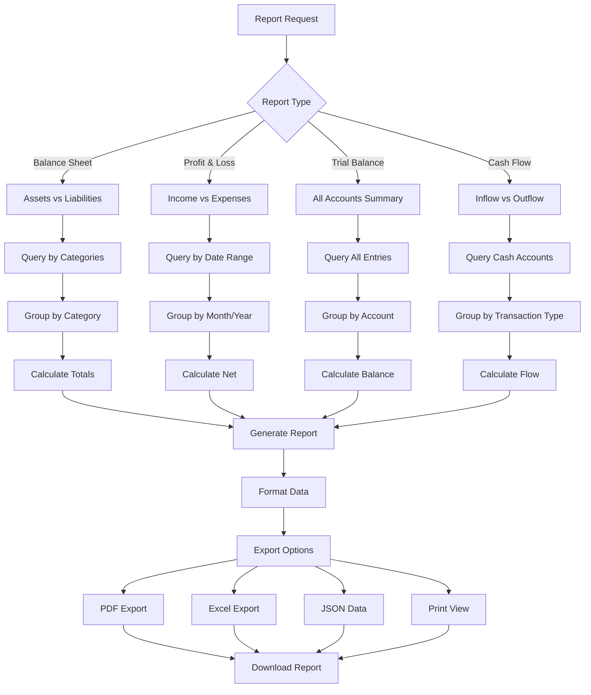
```mermaid
flowchart TD
    A[Report Request] --> B{Report Type}
    
    B -->|Balance Sheet| C[Assets vs Liabilities]
    B -->|Profit & Loss| D[Income vs Expenses]
    B -->|Trial Balance| E[All Accounts Summary]
    B -->|Cash Flow| F[Inflow vs Outflow]
    
    C --> G[Query by Categories]
    D --> H[Query by Date Range]
    E --> I[Query All Entries]
    F --> J[Query Cash Accounts]
    
    G --> K[Group by Category]
    H --> L[Group by Month/Year]
    I --> M[Group by Account]
    J --> N[Group by Transaction Type]
    
    K --> O[Calculate Totals]
    L --> P[Calculate Net]
    M --> Q[Calculate Balance]
    N --> R[Calculate Flow]
    
    O --> S[Generate Report]
    P --> S
    Q --> S
    R --> S
    
    S --> T[Format Data]
    T --> U[Export Options]
    
    U --> V[PDF Export]
    U --> W[Excel Export]
    U --> X[JSON Data]
    U --> Y[Print View]
    
    V --> Z[Download Report]
    W --> Z
    X --> Z
    Y --> Z
```

## Ledger Entry Validation Flow

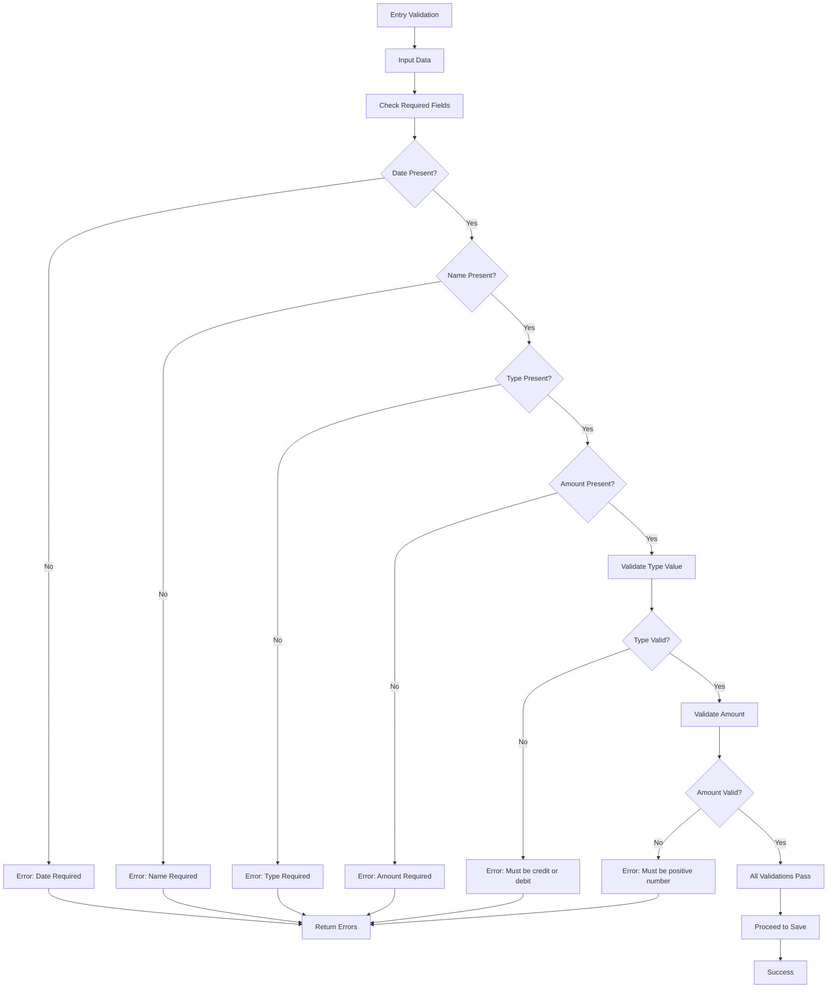
```mermaid
flowchart TD
    A[Entry Validation] --> B[Input Data]
    
    B --> C[Check Required Fields]
    C --> D{Date Present?}
    D -->|No| E[Error: Date Required]
    D -->|Yes| F{Name Present?}
    
    F -->|No| G[Error: Name Required]
    F -->|Yes| H{Type Present?}
    
    H -->|No| I[Error: Type Required]
    H -->|Yes| J{Amount Present?}
    
    J -->|No| K[Error: Amount Required]
    J -->|Yes| L[Validate Type Value]
    
    L --> M{Type Valid?}
    M -->|No| N[Error: Must be credit or debit]
    M -->|Yes| O[Validate Amount]
    
    O --> P{Amount Valid?}
    P -->|No| Q[Error: Must be positive number]
    P -->|Yes| R[All Validations Pass]
    
    R --> S[Proceed to Save]
    
    E --> T[Return Errors]
    G --> T
    I --> T
    K --> T
    N --> T
    Q --> T
    S --> U[Success]
```

## Money Donation System Flow

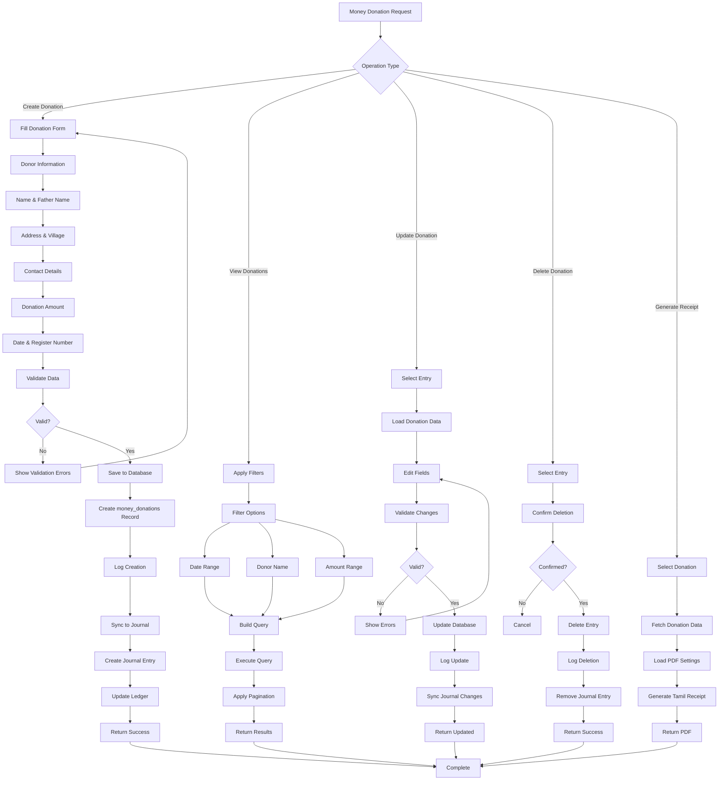
```mermaid
flowchart TD
    A[Money Donation Request] --> B{Operation Type}
    
    B -->|Create Donation| C[Fill Donation Form]
    B -->|View Donations| D[Apply Filters]
    B -->|Update Donation| E[Select Entry]
    B -->|Delete Donation| F[Select Entry]
    B -->|Generate Receipt| G[Select Donation]
    
    C --> H[Donor Information]
    H --> I[Name & Father Name]
    I --> J[Address & Village]
    J --> K[Contact Details]
    K --> L[Donation Amount]
    L --> M[Date & Register Number]
    
    M --> N[Validate Data]
    N --> O{Valid?}
    O -->|No| P[Show Validation Errors]
    O -->|Yes| Q[Save to Database]
    
    Q --> R[Create money_donations Record]
    R --> S[Log Creation]
    S --> T[Sync to Journal]
    T --> U[Create Journal Entry]
    U --> V[Update Ledger]
    V --> W[Return Success]
    
    D --> X[Filter Options]
    X --> Y[Date Range]
    X --> Z[Donor Name]
    X --> AA[Amount Range]
    
    Y --> AB[Build Query]
    Z --> AB
    AA --> AB
    
    AB --> AC[Execute Query]
    AC --> AD[Apply Pagination]
    AD --> AE[Return Results]
    
    E --> AF[Load Donation Data]
    AF --> AG[Edit Fields]
    AG --> AH[Validate Changes]
    AH --> AI{Valid?}
    AI -->|No| AJ[Show Errors]
    AI -->|Yes| AK[Update Database]
    AK --> AL[Log Update]
    AL --> AM[Sync Journal Changes]
    AM --> AN[Return Updated]
    
    F --> AO[Confirm Deletion]
    AO --> AP{Confirmed?}
    AP -->|No| AQ[Cancel]
    AP -->|Yes| AR[Delete Entry]
    AR --> AS[Log Deletion]
    AS --> AT[Remove Journal Entry]
    AT --> AU[Return Success]
    
    G --> AV[Fetch Donation Data]
    AV --> AW[Load PDF Settings]
    AW --> AX[Generate Tamil Receipt]
    AX --> AY[Return PDF]
    
    W --> AZ[Complete]
    AE --> AZ
    AN --> AZ
    AU --> AZ
    AY --> AZ
    P --> C
    AJ --> AG
```

## Money Donation Receipt Generation Flow

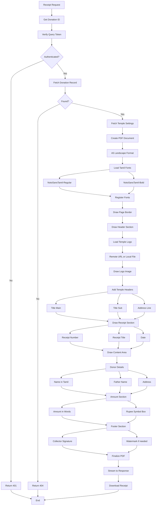
```mermaid
flowchart TD
    A[Receipt Request] --> B[Get Donation ID]
    B --> C[Verify Query Token]
    C --> D{Authenticated?}
    
    D -->|No| E[Return 401]
    D -->|Yes| F[Fetch Donation Record]
    
    F --> G{Found?}
    G -->|No| H[Return 404]
    G -->|Yes| I[Fetch Temple Settings]
    
    I --> J[Create PDF Document]
    J --> K[A5 Landscape Format]
    
    K --> L[Load Tamil Fonts]
    L --> M[NotoSansTamil-Regular]
    L --> N[NotoSansTamil-Bold]
    
    M --> O[Register Fonts]
    N --> O
    
    O --> P[Draw Page Border]
    P --> Q[Draw Header Section]
    
    Q --> R[Load Temple Logo]
    R --> S[Remote URL or Local File]
    
    S --> T[Draw Logo Image]
    T --> U[Add Temple Headers]
    
    U --> V[Title Main]
    U --> W[Title Sub]
    U --> X[Address Line]
    
    V --> Y[Draw Receipt Section]
    W --> Y
    X --> Y
    
    Y --> Z[Receipt Number]
    Y --> AA[Receipt Title]
    Y --> AB[Date]
    
    Z --> AC[Draw Content Area]
    AA --> AC
    AB --> AC
    
    AC --> AD[Donor Details]
    AD --> AE[Name in Tamil]
    AD --> AF[Father Name]
    AD --> AG[Address]
    
    AE --> AH[Amount Section]
    AF --> AH
    AG --> AH
    
    AH --> AI[Amount in Words]
    AH --> AJ[Rupee Symbol Box]
    
    AI --> AK[Footer Section]
    AJ --> AK
    
    AK --> AL[Collector Signature]
    AK --> AM[Watermark if needed]
    
    AL --> AN[Finalize PDF]
    AM --> AN
    
    AN --> AO[Stream to Response]
    AO --> AP[Download Receipt]
    
    E --> AQ[End]
    H --> AQ
    AP --> AQ
```

## Money Donation Journal Sync Flow

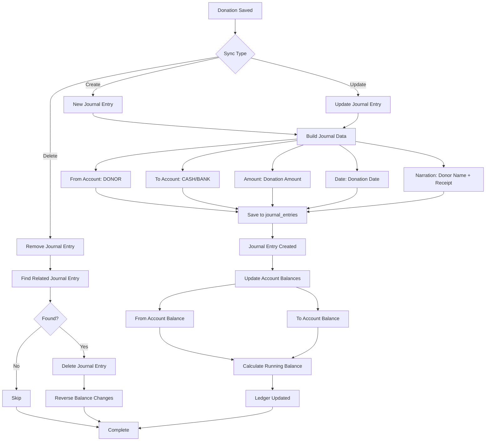
```mermaid
flowchart TD
    A[Donation Saved] --> B{Sync Type}
    
    B -->|Create| C[New Journal Entry]
    B -->|Update| D[Update Journal Entry]
    B -->|Delete| E[Remove Journal Entry]
    
    C --> F[Build Journal Data]
    D --> F
    
    F --> G[From Account: DONOR]
    F --> H[To Account: CASH/BANK]
    F --> I[Amount: Donation Amount]
    F --> J[Date: Donation Date]
    F --> K[Narration: Donor Name + Receipt]
    
    G --> L[Save to journal_entries]
    H --> L
    I --> L
    J --> L
    K --> L
    
    L --> M[Journal Entry Created]
    
    M --> N[Update Account Balances]
    N --> O[From Account Balance]
    N --> P[To Account Balance]
    
    O --> Q[Calculate Running Balance]
    P --> Q
    
    Q --> R[Ledger Updated]
    
    E --> S[Find Related Journal Entry]
    S --> T{Found?}
    T -->|Yes| U[Delete Journal Entry]
    T -->|No| V[Skip]
    
    U --> W[Reverse Balance Changes]
    V --> X[Complete]
    W --> X
    R --> X
```

## Money Donation Data Architecture

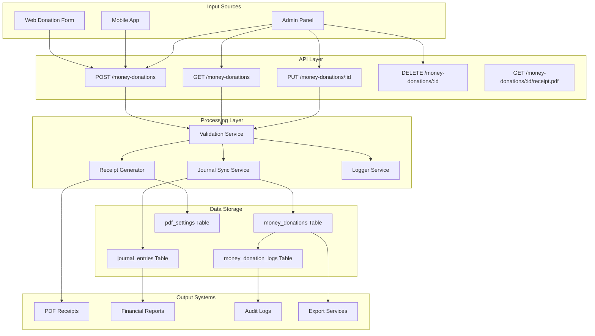
```mermaid
graph TB
    subgraph "Input Sources"
        A[Web Donation Form]
        B[Mobile App]
        C[Admin Panel]
    end
    
    subgraph "API Layer"
        D[POST /money-donations]
        E[GET /money-donations]
        F[PUT /money-donations/:id]
        G[DELETE /money-donations/:id]
        H[GET /money-donations/:id/receipt.pdf]
    end
    
    subgraph "Processing Layer"
        I[Validation Service]
        J[Receipt Generator]
        K[Journal Sync Service]
        L[Logger Service]
    end
    
    subgraph "Data Storage"
        M[money_donations Table]
        N[money_donation_logs Table]
        O[journal_entries Table]
        P[pdf_settings Table]
    end
    
    subgraph "Output Systems"
        Q[PDF Receipts]
        R[Financial Reports]
        S[Audit Logs]
        T[Export Services]
    end
    
    A --> D
    B --> D
    C --> D
    C --> E
    C --> F
    C --> G
    
    D --> I
    E --> I
    F --> I
    
    I --> J
    I --> K
    I --> L
    
    K --> M
    M --> N
    K --> O
    J --> P
    
    J --> Q
    O --> R
    N --> S
    M --> T
```

## Money Donation Logging Flow

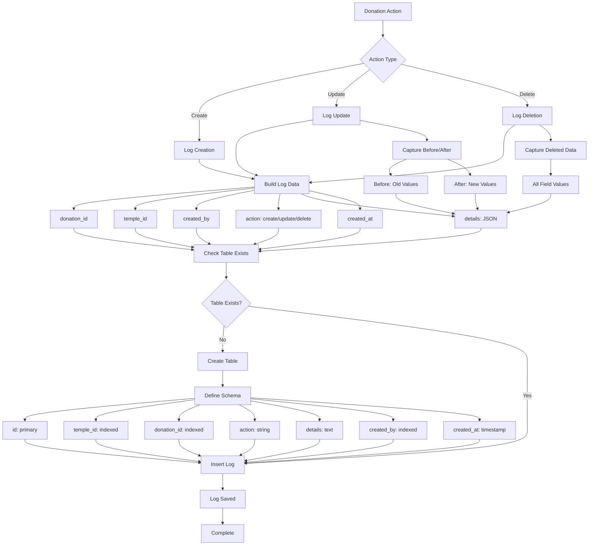
```mermaid
flowchart TD
    A[Donation Action] --> B{Action Type}
    
    B -->|Create| C[Log Creation]
    B -->|Update| D[Log Update]
    B -->|Delete| E[Log Deletion]
    
    C --> F[Build Log Data]
    D --> F
    E --> F
    
    F --> G[donation_id]
    F --> H[temple_id]
    F --> I[created_by]
    F --> J[action: create/update/delete]
    F --> K[details: JSON]
    F --> L[created_at]
    
    G --> M[Check Table Exists]
    H --> M
    I --> M
    J --> M
    K --> M
    L --> M
    
    M --> N{Table Exists?}
    N -->|No| O[Create Table]
    N -->|Yes| P[Insert Log]
    
    O --> Q[Define Schema]
    Q --> R[id: primary]
    Q --> S[temple_id: indexed]
    Q --> T[donation_id: indexed]
    Q --> U[action: string]
    Q --> V[details: text]
    Q --> W[created_by: indexed]
    Q --> X[created_at: timestamp]
    
    R --> P
    S --> P
    T --> P
    U --> P
    V --> P
    W --> P
    X --> P
    
    P --> Y[Log Saved]
    
    D --> Z[Capture Before/After]
    Z --> AA[Before: Old Values]
    Z --> AB[After: New Values]
    AA --> K
    AB --> K
    
    E --> AC[Capture Deleted Data]
    AC --> AD[All Field Values]
    AD --> K
    
    Y --> AE[Complete]
```

## Original Ledger Management Flow

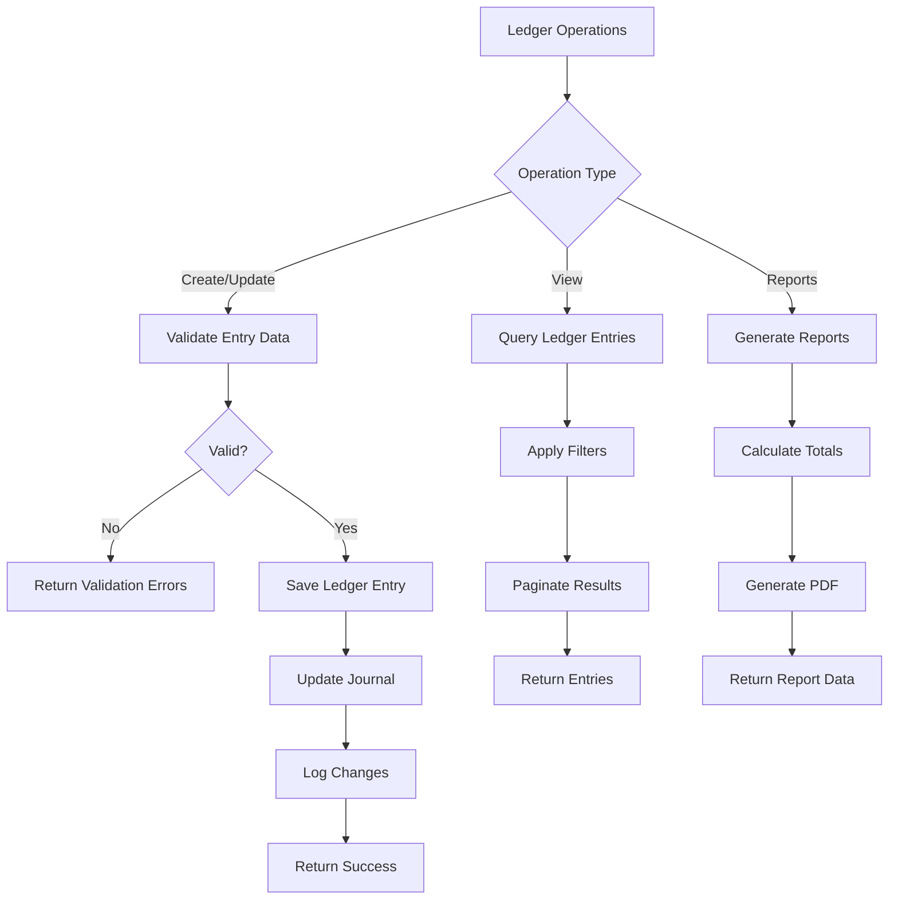
```mermaid
flowchart TD
    A[Ledger Operations] --> B{Operation Type}
    
    B -->|Create/Update| C[Validate Entry Data]
    B -->|View| D[Query Ledger Entries]
    B -->|Reports| E[Generate Reports]
    
    C --> F{Valid?}
    F -->|No| G[Return Validation Errors]
    F -->|Yes| H[Save Ledger Entry]
    H --> I[Update Journal]
    I --> J[Log Changes]
    J --> K[Return Success]
    
    D --> L[Apply Filters]
    L --> M[Paginate Results]
    M --> N[Return Entries]
    
    E --> O[Calculate Totals]
    O --> P[Generate PDF]
    P --> Q[Return Report Data]
```

## Temple Donations Flow

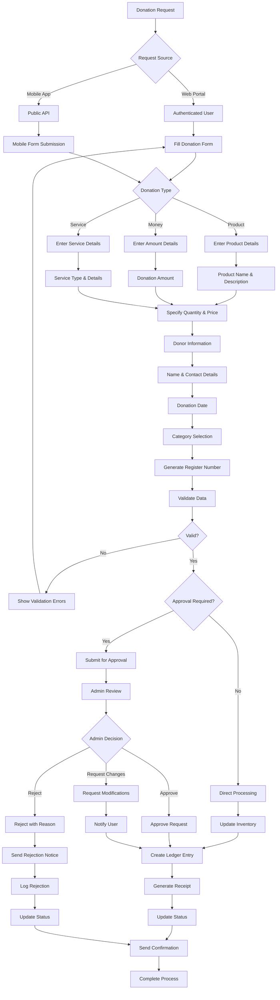
```mermaid
flowchart TD
    A[Donation Request] --> B{Request Source}
    B -->|Web Portal| C[Authenticated User]
    B -->|Mobile App| D[Public API]
    
    C --> E[Fill Donation Form]
    D --> F[Mobile Form Submission]
    
    E --> G{Donation Type}
    F --> G
    
    G -->|Product| H[Enter Product Details]
    G -->|Money| I[Enter Amount Details]
    G -->|Service| J[Enter Service Details]
    
    H --> K[Product Name & Description]
    I --> L[Donation Amount]
    J --> M[Service Type & Details]
    
    K --> N[Specify Quantity & Price]
    L --> N
    M --> N
    
    N --> O[Donor Information]
    O --> P[Name & Contact Details]
    P --> Q[Donation Date]
    Q --> R[Category Selection]
    
    R --> S[Generate Register Number]
    S --> T[Validate Data]
    T --> U{Valid?}
    
    U -->|No| V[Show Validation Errors]
    U -->|Yes| W{Approval Required?}
    
    W -->|No| X[Direct Processing]
    W -->|Yes| Y[Submit for Approval]
    
    X --> Z[Update Inventory]
    Y --> AA[Admin Review]
    
    Z --> BB[Create Ledger Entry]
    AA --> CC{Admin Decision}
    
    CC -->|Approve| DD[Approve Request]
    CC -->|Reject| EE[Reject with Reason]
    CC -->|Request Changes| FF[Request Modifications]
    
    DD --> BB
    EE --> GG[Send Rejection Notice]
    FF --> HH[Notify User]
    
    BB --> II[Generate Receipt]
    GG --> JJ[Log Rejection]
    HH --> BB
    
    II --> KK[Update Status]
    JJ --> LL[Update Status]
    KK --> MM[Send Confirmation]
    LL --> MM
    MM --> NN[Complete Process]
    V --> E
```

## Donation Mobile Integration Flow

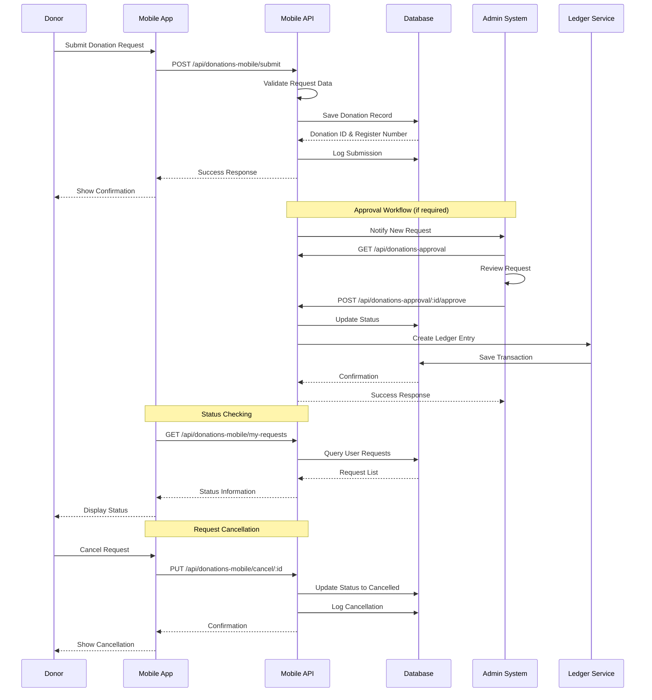
```mermaid
sequenceDiagram
    participant D as Donor
    participant M as Mobile App
    participant API as Mobile API
    participant DB as Database
    participant A as Admin System
    participant L as Ledger Service
    
    D->>M: Submit Donation Request
    M->>API: POST /api/donations-mobile/submit
    API->>API: Validate Request Data
    API->>DB: Save Donation Record
    DB-->>API: Donation ID & Register Number
    API->>DB: Log Submission
    API-->>M: Success Response
    M-->>D: Show Confirmation
    
    Note over API,A: Approval Workflow (if required)
    API->>A: Notify New Request
    A->>API: GET /api/donations-approval
    A->>A: Review Request
    A->>API: POST /api/donations-approval/:id/approve
    API->>DB: Update Status
    API->>L: Create Ledger Entry
    L->>DB: Save Transaction
    DB-->>API: Confirmation
    API-->>A: Success Response
    
    Note over M,API: Status Checking
    M->>API: GET /api/donations-mobile/my-requests
    API->>DB: Query User Requests
    DB-->>API: Request List
    API-->>M: Status Information
    M-->>D: Display Status
    
    Note over M,API: Request Cancellation
    D->>M: Cancel Request
    M->>API: PUT /api/donations-mobile/cancel/:id
    API->>DB: Update Status to Cancelled
    API->>DB: Log Cancellation
    API-->>M: Confirmation
    M-->>D: Show Cancellation
```

## Donation Approval Workflow

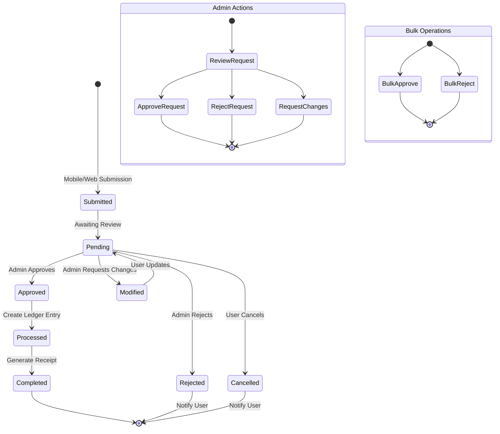
```mermaid
stateDiagram-v2
    [*] --> Submitted: Mobile/Web Submission
    Submitted --> Pending: Awaiting Review
    
    Pending --> Approved: Admin Approves
    Pending --> Rejected: Admin Rejects
    Pending --> Cancelled: User Cancels
    
    Approved --> Processed: Create Ledger Entry
    Processed --> Completed: Generate Receipt
    Completed --> [*]
    
    Rejected --> [*]: Notify User
    Cancelled --> [*]: Notify User
    
    Pending --> Modified: Admin Requests Changes
    Modified --> Pending: User Updates
    
    state "Admin Actions" as Admin {
        [*] --> ReviewRequest
        ReviewRequest --> ApproveRequest
        ReviewRequest --> RejectRequest
        ReviewRequest --> RequestChanges
        ApproveRequest --> [*]
        RejectRequest --> [*]
        RequestChanges --> [*]
    }
    
    state "Bulk Operations" as Bulk {
        [*] --> BulkApprove
        [*] --> BulkReject
        BulkApprove --> [*]
        BulkReject --> [*]
    }
```

## Donation Data Flow Architecture

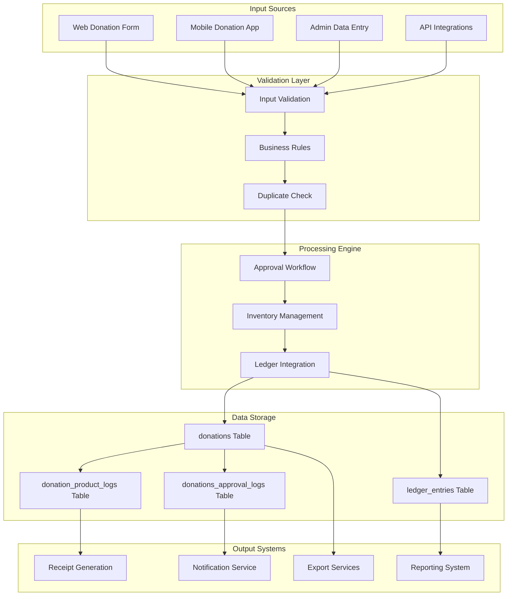
```mermaid
graph TB
    subgraph "Input Sources"
        A[Web Donation Form]
        B[Mobile Donation App]
        C[Admin Data Entry]
        D[API Integrations]
    end
    
    subgraph "Validation Layer"
        E[Input Validation]
        F[Business Rules]
        G[Duplicate Check]
    end
    
    subgraph "Processing Engine"
        H[Approval Workflow]
        I[Inventory Management]
        J[Ledger Integration]
    end
    
    subgraph "Data Storage"
        K[donations Table]
        L[donation_product_logs Table]
        M[donations_approval_logs Table]
        N[ledger_entries Table]
    end
    
    subgraph "Output Systems"
        O[Receipt Generation]
        P[Notification Service]
        Q[Reporting System]
        R[Export Services]
    end
    
    A --> E
    B --> E
    C --> E
    D --> E
    
    E --> F
    F --> G
    G --> H
    
    H --> I
    I --> J
    J --> K
    
    K --> L
    K --> M
    J --> N
    
    L --> O
    M --> P
    N --> Q
    K --> R
```

## Donation Types and Processing

```mermaid
flowchart TD
    A[Donation Request] --> B{Donation Category}
    
    B -->|Product Donation| C[Product Processing]
    B -->|Monetary Donation| D[Money Processing]
    B -->|Service Donation| E[Service Processing]
    B -->|In-Kind Donation| F[Item Processing]
    
    C --> G[Product Details]
    G --> H[Quantity & Valuation]
    H --> I[Inventory Update]
    I --> J[Stock Management]
    
    D --> K[Amount Validation]
    K --> L[Payment Processing]
    L --> M[Financial Recording]
    M --> N[Tax Calculation]
    
    E --> O[Service Description]
    O --> P[Service Valuation]
    P --> Q[Schedule Management]
    Q --> R[Resource Allocation]
    
    F --> S[Item Description]
    S --> T[Condition Assessment]
    T --> U[Valuation]
    U --> V[Storage Management]
    
    J --> W[Generate Receipt]
    N --> W
    R --> W
    V --> W
    
    W --> X[Update Ledger]
    X --> Y[Send Acknowledgment]
    Y --> Z[Complete Process]
```

## Donation Analytics and Reporting

```mermaid
flowchart TD
    A[Donation Data] --> B[Data Collection]
    B --> C[Data Processing]
    C --> D[Analytics Engine]
    
    D --> E{Report Type}
    
    E -->|Summary Reports| F[Donation Summary]
    E -->|Detailed Reports| G[Transaction Details]
    E -->|Trend Analysis| H[Donation Trends]
    E -->|Donor Analytics| I[Donor Insights]
    
    F --> J[Total Donations]
    F --> K[Category Breakdown]
    F --> L[Time Period Analysis]
    
    G --> M[Individual Transactions]
    G --> N[Approval History]
    G --> O[Status Tracking]
    
    H --> P[Monthly Trends]
    H --> Q[Seasonal Patterns]
    H --> R[Growth Metrics]
    
    I --> S[Donor Demographics]
    I --> T[Donation Frequency]
    I --> U[Lifetime Value]
    
    J --> V[Generate Report]
    K --> V
    L --> V
    M --> V
    N --> V
    O --> V
    P --> V
    Q --> V
    R --> V
    S --> V
    T --> V
    U --> V
    
    V --> W[Export Options]
    W --> X[PDF Report]
    W --> Y[Excel Export]
    W --> Z[JSON Data]
```

## Event Management System Flow

```mermaid
flowchart TD
    A[Event Management Request] --> B{Operation Type}
    
    B -->|Create Event| C[Fill Event Form]
    B -->|Update Event| D[Select Existing Event]
    B -->|Delete Event| E[Select Event to Delete]
    B -->|View Events| F[Apply Filters]
    
    C --> G[Event Details]
    G --> H[Title & Description]
    H --> I[Date Range Selection]
    I --> J[From Date]
    I --> K[To Date]
    J --> L{Valid Range?}
    K --> L
    L -->|No| M[Show Date Error]
    L -->|Yes| N[Location]
    N --> O[Upload Images]
    
    O --> P[Image Processing]
    P --> Q[Compression & Storage]
    Q --> R[Save Event]
    R --> S[Save Image Metadata]
    S --> T[Update Calendar with Date Range]
    T --> U[Generate Confirmation]
    
    D --> V[Load Event Data]
    V --> W[Edit Details]
    W --> X[Update Date Range]
    X --> Y[From Date]
    X --> Z[To Date]
    Y --> AA[Save Changes]
    Z --> AA
    AA --> S
    
    E --> AB[Confirm Deletion]
    AB --> AC{Confirmed?}
    AC -->|No| AD[Cancel Operation]
    AC -->|Yes| AE[Delete Images]
    AE --> AF[Delete Event Record]
    AF --> AG[Update Calendar]
    AG --> AH[Confirm Deletion]
    
    F --> AI[Search & Filter]
    AI --> AJ[Date Range Filter]
    AJ --> AK[From Date]
    AJ --> AL[To Date]
    AK --> AM[Paginate Results]
    AL --> AM
    AM --> AN[Display Events]
    
    U --> AO[Complete Process]
    AH --> AO
    AN --> AO
    AD --> AO
    M --> C
```

## Event Mobile Calendar Integration Flow

```mermaid
sequenceDiagram
    participant U as User
    participant M as Mobile App
    participant API as Calendar API
    participant DB as Database
    participant E as Events System
    participant P as Pooja System
    participant H as Hall System
    
    Note over M,API: Daily Calendar View
    U->>M: Request Today's Calendar
    M->>API: GET /api/mobile/calendar/today
    API->>DB: Query Today's Events
    API->>DB: Query Approved Pooja
    API->>DB: Query Approved Hall Bookings
    DB-->>API: Combined Calendar Data
    API-->>M: Formatted Calendar Response
    M-->>U: Display Daily Schedule
    
    Note over M,API: Specific Date View
    U->>M: Select Specific Date
    M->>API: GET /api/mobile/calendar?date=YYYY-MM-DD
    API->>E: Get Events for Date
    API->>P: Get Pooja for Date
    API->>H: Get Hall Bookings for Date
    E-->>API: Event List
    P-->>API: Pooja List
    H-->>API: Booking List
    API-->>M: Unified Calendar Data
    M-->>U: Show Date Details
    
    Note over M,API: Date Range View
    U->>M: Request Date Range
    M->>API: GET /api/mobile/calendar/range?from=...&to=...
    API->>DB: Query Events in Range
    API->>DB: Query Pooja in Range
    API->>DB: Query Hall Bookings in Range
    DB-->>API: Range Data
    API->>API: Group by Date
    API-->>M: Formatted Range Response
    M-->>U: Display Range Calendar
```

## Event Image Management Flow

```mermaid
flowchart TD
    A[Image Management] --> B{Operation Type}
    
    B -->|Upload Images| C[Select Image Files]
    B -->|Update Image Info| D[Select Existing Image]
    B -->|Delete Images| E[Select Images to Delete]
    
    C --> F[Validate Image Files]
    F --> G{Valid?}
    G -->|No| H[Show Validation Errors]
    G -->|Yes| I[Upload to Temp]
    I --> J[Compress Images]
    J --> K[Save to Storage]
    K --> L[Generate URLs]
    L --> M[Save Metadata]
    M --> N[Update Event]
    
    D --> O[Load Image Metadata]
    O --> P[Edit Title/Caption]
    P --> Q[Save Changes]
    Q --> R[Update Database]
    
    E --> S[Confirm Deletion]
    S --> T{Confirmed?}
    T -->|No| U[Cancel Operation]
    T -->|Yes| V[Delete Files]
    V --> W[Delete Metadata]
    W --> X[Update Event]
    
    N --> Y[Complete Process]
    R --> Y
    X --> Y
    U --> Y
    H --> C
```

## Event Data Architecture

```mermaid
graph TB
    subgraph "Input Sources"
        A[Web Event Form]
        B[Mobile Calendar API]
        C[Admin Panel]
        D[Image Upload]
    end
    
    subgraph "Processing Layer"
        E[Event Validation]
        F[Image Processing]
        G[Calendar Integration]
        H[Search & Filtering]
    end
    
    subgraph "Data Storage"
        I[events Table]
        J[event_images Table]
        K[Calendar Integration]
        L[File System Storage]
    end
    
    subgraph "Output Systems"
        M[Calendar Views]
        N[Image Galleries]
        O[Search Results]
        P[Mobile API Responses]
    end
    
    A --> E
    B --> E
    C --> E
    D --> F
    
    E --> G
    F --> G
    G --> H
    
    H --> I
    I --> J
    F --> L
    G --> K
    
    I --> M
    J --> N
    H --> O
    K --> P
```

## Event Calendar Integration Flow

```mermaid
flowchart TD
    A[Calendar Request] --> B{Request Type}
    
    B -->|Daily View| C[Get Today's Events]
    B -->|Specific Date| D[Get Date Events]
    B -->|Date Range| E[Get Range Events]
    B -->|All Events| F[Get All Events]
    
    C --> G[Query Events Table]
    D --> G
    E --> G
    F --> G
    
    G --> H[Query Pooja Table]
    G --> I[Query Hall Bookings]
    
    H --> J[Filter by Date]
    I --> J
    I --> K[Filter by Status]
    
    J --> L[Merge Event Data]
    K --> L
    
    L --> M[Group by Date]
    M --> N[Sort by Time]
    N --> O[Format Response]
    
    O --> P{Response Format}
    P -->|Mobile| Q[Mobile JSON Format]
    P -->|Web| R[Web Component Format]
    
    Q --> S[Include Event Types]
    R --> T[Include UI Components]
    
    S --> U[Return Calendar Data]
    T --> U
```

## Kanikalar (Wedding) Management System Flow

```mermaid
flowchart TD
    A[Wedding Request] --> B{Operation Type}
    
    B -->|Create Wedding| C[Fill Wedding Form]
    B -->|View Weddings| D[Get Wedding List]
    B -->|Update Wedding| E[Select Wedding]
    B -->|Delete Wedding| F[Select Wedding]
    B -->|Manage Events| G[Select Wedding]
    
    C --> H[Wedding Details]
    H --> I[Bride Name]
    I --> J[Groom Name]
    J --> K[Wedding Date]
    K --> L[Venue]
    L --> M[Contact Info]
    M --> N[Email]
    
    N --> O[Validate Data]
    O --> P{Valid?}
    P -->|No| Q[Show Errors]
    P -->|Yes| R[Save to Database]
    
    R --> S[Create kanikalar Record]
    S --> T[Set Temple ID]
    T --> U[Set Created By]
    U --> V[Return Success]
    
    D --> W[Query Database]
    W --> X[Filter by Temple]
    X --> Y[Return Wedding List]
    
    E --> Z[Load Wedding Data]
    Z --> AA[Edit Fields]
    AA --> AB[Validate Changes]
    AB --> AC{Valid?}
    AC -->|No| AD[Show Errors]
    AC -->|Yes| AE[Update Database]
    AE --> AF[Return Success]
    
    F --> AG[Confirm Deletion]
    AG --> AH{Confirmed?}
    AH -->|No| AI[Cancel]
    AH -->|Yes| AJ[Delete Events First]
    AJ --> AK[Delete Wedding]
    AK --> AL[Return Success]
    
    G --> AM[View Events]
    AM --> AN[Add/Edit/Delete Events]
    
    V --> AO[Complete]
    Y --> AO
    AF --> AO
    AL --> AO
    AN --> AO
    Q --> C
    AD --> AA
```

## Kanikalar Wedding Events Management Flow

```mermaid
flowchart TD
    A[Event Management] --> B{Operation Type}
    
    B -->|Create Event| C[Fill Event Form]
    B -->|View Events| D[Get Events List]
    B -->|Update Event| E[Select Event]
    B -->|Delete Event| F[Select Event]
    
    C --> G[Event Details]
    G --> H[Select Wedding]
    H --> I[Event Name]
    I --> J[Event Date]
    J --> K[Event Time]
    K --> L[Location]
    L --> M[Description]
    
    M --> N[Verify Wedding Exists]
    N --> O{Wedding Found?}
    O -->|No| P[Return 404]
    O -->|Yes| Q[Check Temple Ownership]
    Q --> R{Authorized?}
    R -->|No| S[Return 403]
    R -->|Yes| T[Validate Fields]
    
    T --> U{Valid?}
    U -->|No| V[Show Errors]
    U -->|Yes| W[Save Event]
    
    W --> X[Create wedding_events Record]
    X --> Y[Set Kanikalar ID]
    Y --> Z[Set Created By]
    Z --> AA[Return Success]
    
    D --> AB[Query Events]
    AB --> AC[Verify Wedding]
    AC --> AD[Filter by Kanikalar ID]
    AD --> AE[Return Events]
    
    E --> AF[Load Event Data]
    AF --> AG[Verify Ownership]
    AG --> AH[Edit Fields]
    AH --> AI[Validate Changes]
    AI --> AJ{Valid?}
    AJ -->|No| AK[Show Errors]
    AJ -->|Yes| AL[Update Database]
    AL --> AM[Return Success]
    
    F --> AN[Verify Ownership]
    AN --> AO[Confirm Deletion]
    AO --> AP{Confirmed?}
    AP -->|No| AQ[Cancel]
    AP -->|Yes| AR[Delete Event]
    AR --> AS[Return Success]
    
    AA --> AT[Complete]
    AE --> AT
    AM --> AT
    AS --> AT
    P --> AT
    S --> AT
    V --> C
    AK --> AH
```

## Master Data Management System Flow

```mermaid
flowchart TD
    A[Master Data Request] --> B{Entity Type}
    
    B -->|Clans| C[Master Clans]
    B -->|Groups| D[Master Groups]
    B -->|Educations| E[Master Educations]
    B -->|Occupations| F[Master Occupations]
    B -->|Halls| G[Master Halls]
    B -->|Hall Events| H[Master Hall Events]
    B -->|People| I[Master People]
    
    C --> J{Operation}
    D --> J
    E --> J
    F --> J
    G --> J
    H --> J
    I --> J
    
    J -->|Create| K[Fill Form]
    J -->|View| L[Get List]
    J -->|Update| M[Select Entry]
    J -->|Delete| N[Select Entry]
    
    K --> O[Name Field]
    K --> P[Description Field]
    G --> Q[Base Price Field]
    
    O --> R[Validate Name]
    P --> R
    Q --> R
    
    R --> S{Name Present?}
    S -->|No| T[Return Error]
    S -->|Yes| U[Check Temple Access]
    
    U --> V{Authorized?}
    V -->|No| W[Return 403]
    V -->|Yes| X[Save to Database]
    
    X --> Y[Set Temple ID]
    Y --> Z[Set Timestamps]
    Z --> AA[Return Success]
    
    L --> AB[Query by Temple]
    AB --> AC[Return List]
    
    M --> AD[Load Entry]
    AD --> AE[Verify Ownership]
    AE --> AF{Authorized?}
    AF -->|No| AG[Return 403]
    AF -->|Yes| AH[Edit Fields]
    AH --> AI[Validate]
    AI --> AJ[Update Database]
    AJ --> AK[Return Success]
    
    N --> AL[Verify Ownership]
    AL --> AM{Authorized?}
    AM -->|No| AN[Return 403]
    AM -->|Yes| AO[Check References]
    
    AO --> AP{In Use?}
    AP -->|Yes| AQ[Return Error]
    AP -->|No| AR[Delete Entry]
    AR --> AS[Return Success]
    
    AA --> AT[Complete]
    AC --> AT
    AK --> AT
    AS --> AT
    T --> K
    AH --> AI
```

## Master Data Referential Integrity Flow

```mermaid
flowchart TD
    A[Delete Request] --> B[Entity Type]
    
    B -->|Education| C[Check User Registrations]
    B -->|Occupation| D[Check User Registrations]
    B -->|Group| E[Check User Registrations]
    B -->|Hall| F[Check Hall Bookings]
    B -->|Hall Event| G[Check Hall Bookings]
    
    C --> H[Query user_registrations]
    D --> H
    E --> H
    F --> I[Query marriage_hall_bookings]
    G --> I
    
    H --> J[Filter by Name Value]
    I --> K[Filter by ID Reference]
    
    J --> L{Records Found?}
    K --> M{Records Found?}
    
    L -->|Yes| N[Return Error]
    L -->|No| O[Allow Delete]
    M -->|Yes| P[Return Error]
    M -->|No| Q[Allow Delete]
    
    N --> R[Message: Cannot delete - in use]
    P --> S[Message: Cannot delete - referenced]
    
    O --> T[Execute DELETE]
    Q --> T
    
    T --> U[Return Success]
    R --> V[End]
    S --> V
    U --> V
```

## Master Data Architecture

```mermaid
graph TB
    subgraph "Master Data Router"
        A[master-data/index.js]
    end
    
    subgraph "Entity Routes"
        B[masterPeople.js]
        C[masterGroups.js]
        D[masterClans.js]
        E[masterOccupations.js]
        F[masterEducations.js]
        G[masterHalls.js]
        H[masterHallEvents.js]
    end
    
    subgraph "API Endpoints"
        I[POST /:entity]
        J[GET /:entity/:templeId]
        K[PUT /:entity/:id]
        L[DELETE /:entity/:id]
    end
    
    subgraph "Processing Layer"
        M[Validation]
        N[Ownership Check]
        O[Referential Integrity]
        P[retryOnBusy]
    end
    
    subgraph "Database Tables"
        Q[master_clans]
        R[master_groups]
        S[master_educations]
        T[master_occupations]
        U[master_halls]
        V[master_hall_events]
        W[master_people]
    end
    
    subgraph "Referencing Tables"
        X[user_registrations]
        Y[marriage_hall_bookings]
    end
    
    A --> B
    A --> C
    A --> D
    A --> E
    A --> F
    A --> G
    A --> H
    
    B --> I
    C --> I
    D --> I
    E --> I
    F --> I
    G --> I
    H --> I
    
    I --> M
    J --> M
    K --> M
    L --> M
    
    M --> N
    N --> O
    O --> P
    
    P --> Q
    P --> R
    P --> S
    P --> T
    P --> U
    P --> V
    P --> W
    
    Q -.->|clan| X
    R -.->|group| X
    S -.->|education| X
    T -.->|occupation| X
    U -.->|hall_id| Y
    V -.->|event_id| Y
```

## Master Data CRUD Sequence Flow

```mermaid
sequenceDiagram
    participant U as Admin User
    participant F as Frontend
    participant API as Master Data API
    participant V as Validation
    participant O as Ownership Check
    participant R as Referential Check
    participant DB as Database
    
    Note over U,DB: CREATE Operation
    U->>F: Fill Master Data Form
    F->>API: POST /api/master/:entity
    API->>V: Validate Name Present
    V-->>API: Valid
    API->>DB: retryOnBusy INSERT
    DB-->>API: New Record ID
    API-->>F: Return 201 Success
    F-->>U: Show Confirmation
    
    Note over U,DB: READ Operation
    U->>F: Request Master Data List
    F->>API: GET /api/master/:entity/:templeId
    API->>DB: Query by Temple
    DB-->>API: Entity List
    API-->>F: Return JSON Array
    F-->>U: Display List
    
    Note over U,DB: UPDATE Operation
    U->>F: Edit Entry
    F->>API: PUT /api/master/:entity/:id
    API->>O: Check Ownership
    O->>DB: Verify Temple Match
    DB-->>O: Authorized
    O-->>API: Continue
    API->>V: Validate Changes
    V-->>API: Valid
    API->>DB: retryOnBusy UPDATE
    DB-->>API: Success
    API-->>F: Return 200
    F-->>U: Show Updated
    
    Note over U,DB: DELETE Operation
    U->>F: Delete Entry
    F->>API: DELETE /api/master/:entity/:id
    API->>O: Check Ownership
    O->>DB: Verify Temple Match
    DB-->>O: Authorized
    O-->>API: Continue
    API->>R: Check References
    R->>DB: Query Referencing Tables
    DB-->>R: No References
    R-->>API: Safe to Delete
    API->>DB: retryOnBusy DELETE
    DB-->>API: Success
    API-->>F: Return 200
    F-->>U: Confirm Deletion
```

## Kanikalar Data Architecture

```mermaid
graph TB
    subgraph "Input Sources"
        A[Wedding Form]
        B[Wedding Event Form]
        C[Admin Panel]
    end
    
    subgraph "API Layer"
        D[POST /kanikalar]
        E[GET /kanikalar]
        F[PUT /kanikalar/:id]
        G[DELETE /kanikalar/:id]
        H[POST /wedding-events]
        I[GET /wedding-events/:id]
        J[PUT /wedding-events/:id]
        K[DELETE /wedding-events/:id]
    end
    
    subgraph "Processing Layer"
        L[Validation Service]
        M[Ownership Check]
        N[Event Management]
    end
    
    subgraph "Data Storage"
        O[kanikalar Table]
        P[wedding_events Table]
    end
    
    subgraph "Output Systems"
        Q[Wedding List]
        R[Event Schedule]
        S[Wedding Details]
    end
    
    A --> D
    A --> E
    A --> F
    A --> G
    B --> H
    B --> I
    B --> J
    B --> K
    C --> D
    C --> E
    C --> F
    C --> G
    
    D --> L
    E --> L
    F --> L
    G --> L
    H --> L
    I --> L
    J --> L
    K --> L
    
    L --> M
    M --> N
    
    N --> O
    N --> P
    
    O --> Q
    P --> R
    O --> S
```

## Event Search and Filtering Flow

```mermaid
flowchart TD
    A[Search Request] --> B[Parse Search Parameters]
    B --> C{Search Type}
    
    C -->|Text Search| D[Search Title/Description]
    C -->|Date Filter| E[Filter by Date Range]
    C -->|Location Filter| F[Filter by Location]
    C -->|Combined| G[Apply Multiple Filters]
    
    D --> H[Build Text Query]
    E --> I[Build Date Query]
    F --> J[Build Location Query]
    G --> K[Build Combined Query]
    
    H --> L[Execute Query]
    I --> L
    J --> L
    K --> L
    
    L --> M[Get Results]
    M --> N[Apply Pagination]
    N --> O[Sort Results]
    O --> P[Format Response]
    
    P --> Q{Result Count}
    Q -->|Zero| R[Return Empty Result]
    Q -->|Has Results| S[Return Event List]
    
    R --> T[Display No Results Message]
    S --> U[Display Event List]
```

## Pooja Management System Flow

```mermaid
flowchart TD
    A[Pooja Request] --> B{Request Source}
    
    B -->|Web Portal| C[Authenticated User]
    B -->|Mobile App| D[Mobile API]
    
    C --> E{Check Multi-Pooja Setting}
    D --> E
    
    E -->|Single Pooja Only| F[Check Existing Booking]
    F --> G{Date Available?}
    G -->|No| H[Return: Date Already Booked]
    G -->|Yes| I[Select Pooja Type]
    
    E -->|Multi-Pooja ON| I
    
    I --> J{Pooja Budget Type}
    J -->|Normal| K[Standard Pooja]
    J -->|Template| L[Template Pooja]
    
    K --> M[Select Pooja Name]
    L --> N[Select Template]
    N --> O[Load Template Items]
    
    M --> P[Check Availability]
    O --> P
    
    P --> Q{Available?}
    Q -->|No| R[Suggest Alternatives]
    Q -->|Yes| S[Fill Booking Form]
    
    D --> T[Mobile Submission]
    T --> U{Valid?}
    U -->|No| V[Return Error]
    U -->|Yes| W[Check Conflicts]
    
    W --> X{Conflict?}
    X -->|Yes| Y[Return Conflict]
    X -->|No| Z[Save as Pending]
    
    S --> AA[Devotee Details]
    AA --> AB[Primary Person Details]
    AA --> AC[Select Group Members]
    
    AC --> AD{Group Booking?}
    AD -->|Yes| AE[Select Members from Group]
    AE --> AF[10 Members Max]
    AD -->|No| AG[Single Person]
    
    AF --> AH[Contact Information]
    AG --> AH
    
    AH --> AI[Date Range Selection]
    AI --> AJ[Time Slot Selection]
    AJ --> AK{Recurring Pooja?}
    
    AK -->|Yes| AL[Set Recurrence Pattern]
    AL --> AM[Daily/Weekly/Monthly]
    AK -->|No| AN[One-time Booking]
    
    AM --> AO[Items & Budget]
    AN --> AO
    
    AO --> AP[Load Budget Items]
    AP --> AQ[Template Items]
    AP --> AR[Custom Items]
    
    AQ --> AS[Item Management]
    AR --> AS
    AS --> AT[Add Items]
    AS --> AU[Edit Items]
    AS --> AV[Remove Items]
    
    AT --> AW[Item Name]
    AU --> AW
    AV --> AW
    AW --> AX[Quantity]
    AX --> AY[Price]
    
    AY --> AZ[Calculate Total Budget]
    
    AZ --> BA[Female Count & ID]
    BA --> BB[Number of Females]
    BA --> BC[ID Proof Upload]
    
    BB --> BD[Generate Receipt Number]
    BC --> BD
    
    BD --> BE{Direct Approval?}
    
    BE -->|Yes| BF[Create Booking]
    BE -->|No| BG[Submit for Approval]
    
    BF --> BH[Update Calendar]
    BG --> BI[Admin Review]
    
    BH --> BJ[Log Creation]
    BI --> BK{Admin Decision}
    
    BK -->|Approve| BL[Approve Pooja]
    BK -->|Reject| BM[Reject with Reason]
    BK -->|Request Changes| BN[Request Modifications]
    
    BL --> BJ
    BM --> BO[Notify Rejection]
    BN --> BP[Notify User]
    
    BJ --> BQ[Send Confirmation]
    BO --> BR[Update Status]
    BP --> BS[User Updates]
    BS --> BI
    
    BQ --> BT[Complete Process]
    BR --> BT
    
    Z --> BU[Return Pending Status]
    H --> BV[End Process]
    V --> BV
    Y --> BV
    BU --> BV
```

## Pooja Approval Workflow

```mermaid
stateDiagram-v2
    [*] --> Submitted: Mobile/Web Submission
    Submitted --> Pending: Awaiting Review
    
    Pending --> Approved: Admin Approves
    Pending --> Rejected: Admin Rejects
    Pending --> Cancelled: User Cancels
    
    Approved --> Confirmed: Update Calendar
    Confirmed --> Completed: Send Confirmation
    Completed --> [*]
    
    Rejected --> [*]: Notify User
    Cancelled --> [*]: Notify User
    
    Pending --> Modified: Admin Requests Changes
    Modified --> Pending: User Updates
    
    state "Admin Actions" as Admin {
        [*] --> ViewPendingList
        ViewPendingList --> ReviewDetails
        ReviewDetails --> CheckConflicts
        CheckConflicts --> CheckAvailability
        CheckAvailability --> ApprovePooja
        CheckConflicts --> RejectPooja
        ReviewDetails --> RequestChanges
        ApprovePooja --> [*]
        RejectPooja --> [*]
        RequestChanges --> [*]
    }
    
    state "Bulk Operations" as Bulk {
        [*] --> SelectMultiple
        SelectMultiple --> BulkApprove
        SelectMultiple --> BulkReject
        BulkApprove --> [*]
        BulkReject --> [*]
    }
```

## Pooja Mobile Integration Flow

```mermaid
sequenceDiagram
    participant U as Devotee
    participant M as Mobile App
    participant API as Pooja Mobile API
    participant DB as Database
    participant A as Admin System
    participant C as Calendar System
    
    Note over U,API: Authentication
    U->>M: Login with Mobile
    M->>API: POST /api/mobile/login
    API-->>M: JWT Token
    M-->>U: Authenticated
    
    Note over M,API: Check Available Slots
    U->>M: View Available Times
    M->>API: GET /api/pooja-mobile/available-slots
    API->>DB: Query Approved Bookings
    DB-->>API: Booked Time Slots
    API->>API: Generate All Slots (6AM-10PM)
    API->>API: Filter Available
    API-->>M: Available Slots List
    M-->>U: Display Time Options
    
    Note over M,API: Submit Pooja Request
    U->>M: Fill Pooja Details
    M->>API: POST /api/pooja-mobile/submit
    API->>API: Validate Fields
    API->>DB: Check Time Conflicts
    
    alt Conflict Found
        API-->>M: Return 400 Conflict
        M-->>U: Show Alternative Times
    else No Conflict
        API->>DB: Insert Pending Pooja
        API->>DB: Log Submission
        API-->>M: Return Success + ID
        M-->>U: Show Pending Status
    end
    
    Note over A,C: Admin Approval
    A->>API: GET /api/pooja-approval
    API->>DB: Query Pending Poojas
    DB-->>API: Pending List
    A->>A: Review Details
    A->>API: POST /api/pooja-approval/approve/:id
    API->>DB: Update Status to Approved
    API->>C: Update Calendar
    API->>DB: Log Approval
    API-->>A: Confirmation
    
    Note over M,API: Track Request
    U->>M: Check My Requests
    M->>API: GET /api/pooja-mobile/my-requests
    API->>DB: Query User Poojas
    DB-->>API: Request List with Status
    M-->>U: Display Status & History
    
    Note over M,API: Cancel Request
    U->>M: Cancel Pending Request
    M->>API: PUT /api/pooja-mobile/cancel/:id
    API->>DB: Check Status = Pending
    API->>DB: Update to Cancelled
    API->>DB: Log Cancellation
    API-->>M: Confirmation
    M-->>U: Show Cancelled
```

## Pooja Calendar & Booking View Flow

```mermaid
flowchart TD
    A[Calendar Request] --> B{View Type}
    
    B -->|Month View| C[Get Month Bookings]
    B -->|Specific Date| D[Get Date Bookings]
    B -->|Date Range| E[Get Range Bookings]
    
    C --> F[Query Pooja Table]
    D --> F
    E --> F
    
    F --> G[Filter by Temple]
    G --> H[Filter Overlapping Dates]
    
    H --> I[Get All Bookings]
    I --> J[Filter in JavaScript]
    
    J --> K[Check Date Overlap]
    K --> L[Start Date <= Month End]
    K --> M[End Date >= Month Start]
    
    L --> N[Collect Matching Bookings]
    M --> N
    
    N --> O[Format Response]
    O --> P[Add Booking Details]
    P --> Q[ID, Receipt, Name, Dates, Time]
    
    Q --> R[Return Calendar Data]
    
    R --> S[Display in Calendar]
    S --> T[Color by Status]
    T --> U[Approved = Green]
    T --> V[Pending = Yellow]
    T --> W[Rejected = Red]
```

## Pooja Time Slot Management Flow

```mermaid
flowchart TD
    A[Time Slot Request] --> B[Input: Date Range]
    
    B --> C[Query Approved Poojas]
    C --> D[Filter by Date Range]
    D --> E[Get Booked Times]
    
    E --> F[Extract Time Values]
    F --> G[Create Booked List]
    
    A --> H[Generate All Slots]
    H --> I[6:00 AM to 10:00 PM]
    I --> J[Every 30 Minutes]
    
    J --> K[6:00, 6:30, 7:00...]
    K --> L[Total 33 Slots/Day]
    
    L --> M[Filter Available]
    G --> M
    
    M --> N[Remove Booked from All]
    N --> O[Available Slots List]
    
    O --> P[Build Response]
    P --> Q[available_slots: Array]
    P --> R[booked_slots: Array]
    P --> S[total_available: Count]
    P --> T[total_booked: Count]
    
    Q --> U[Return to Client]
    R --> U
    S --> U
    T --> U
```

## Pooja Data Architecture

```mermaid
graph TB
    subgraph "Input Sources"
        A[Web Booking Form]
        B[Mobile App]
        C[Admin Panel]
    end
    
    subgraph "API Layer"
        D[GET /pooja]
        E[POST /pooja]
        F[PUT /pooja/:id]
        G[DELETE /pooja/:id]
        H[GET /pooja-mobile/*]
    end
    
    subgraph "Processing Layer"
        I[Conflict Detection]
        J[Availability Check]
        K[Approval Workflow]
        L[Calendar Integration]
    end
    
    subgraph "Data Storage"
        M[pooja Table]
        N[pooja_logs Table]
        O[pooja_approval_logs Table]
        P[marriage_hall_bookings Table]
        Q[events Table]
    end
    
    subgraph "Output Systems"
        R[Calendar Views]
        S[Mobile Notifications]
        T[Email Confirmations]
        U[Receipt PDFs]
    end
    
    A --> D
    A --> E
    B --> H
    C --> F
    C --> G
    
    D --> I
    E --> J
    H --> I
    
    I --> K
    J --> K
    K --> L
    
    K --> M
    M --> N
    K --> O
    L --> P
    L --> Q
    
    M --> R
    M --> S
    M --> T
    M --> U
```

## Pooja Receipt Number Generation Flow

```mermaid
flowchart TD
    A[Receipt Request] --> B{Generation Type}
    
    B -->|Year-Based| C[Get Current Year]
    B -->|Sequential| D[Get Latest Number]
    
    C --> E[Query YYYY-% Pattern]
    D --> F[Query All Receipts]
    
    E --> G[Find Latest YYYY-XXXX]
    F --> H[Find Max ID]
    
    G --> I[Extract Number Part]
    H --> I
    
    I --> J[Increment by 1]
    J --> K[Pad with Zeros]
    K --> L[Format: YYYY-NNNN]
    
    L --> M[Check Uniqueness]
    M --> N{Exists?}
    N -->|Yes| O[Increment Again]
    N -->|No| P[Return Receipt Number]
    
    O --> K
    P --> Q[Save with Booking]
    
    B -->|By Temple| R[Filter by Temple ID]
    R --> S[Query Temple Bookings]
    S --> T[Get Latest for Temple]
    T --> I
```

## Pooja Original Booking System Flow

```mermaid
flowchart TD
    A[Pooja Booking Request] --> B[Check Availability]
    B --> C{Available?}
    C -->|No| D[Suggest Alternative Dates]
    C -->|Yes| E[Calculate Charges]
    E --> F[Collect Payment Details]
    F --> G{Payment Method}
    G -->|Cash| H[Mark as Pending Payment]
    G -->|Online| I[Process Payment]
    I --> J{Payment Success?}
    J -->|No| K[Show Payment Error]
    J -->|Yes| L[Confirm Booking]
    H --> M[Generate Receipt]
    L --> M
    M --> N[Update Calendar]
    N --> O[Send Confirmation]
```

## New Moon Days (Moon Phases) System Flow

```mermaid
flowchart TD
    A[Moon Phase Request] --> B{Request Type}
    
    B -->|Calculate Phases| C[Get Date Range]
    B -->|Save Custom Date| D[Enter Date & Label]
    B -->|View Saved Dates| E[Get Date Range]
    B -->|Delete Date| F[Select Date]
    
    C --> G[Validate Dates]
    G --> H{Astronomical Calculation}
    H -->|Algorithm| I[Reference New Moon]
    I --> J[Calculate Synodic Months]
    J --> K[Determine Phase Dates]
    
    K --> L[Generate Phase Data]
    L --> M[Return Moon Phases]
    
    D --> N[Validate Input]
    N --> O[Check Existing]
    O --> P{Exists?}
    P -->|Yes| Q[Update Entry]
    P -->|No| R[Create Entry]
    Q --> S[Save to JSON]
    R --> S
    S --> T[Return Success]
    
    E --> U[Read JSON File]
    U --> V[Filter by Range]
    V --> W[Return Dates]
    
    F --> X[Decode URL]
    X --> Y[Remove from JSON]
    Y --> Z[Return 204]
    
    M --> AA[Complete Process]
    T --> AA
    W --> AA
    Z --> AA
```

## Moon Phase Calculation Algorithm Flow

```mermaid
flowchart TD
    A[Calculate Moon Phases] --> B[Input: Start & End Dates]
    B --> C[Convert to Milliseconds]
    
    C --> D[Calculate Days Since Reference]
    D --> E[Reference New Moon: 2000-01-06 18:14 UTC]
    E --> F[Synodic Month: 29.530588853 days]
    
    F --> G[Initialize k Index]
    G --> H[Loop Through Months]
    
    H --> I[Calculate Phase Times]
    I --> J[New Moon: offset 0]
    I --> K[First Quarter: offset 0.25]
    I --> L[Full Moon: offset 0.5]
    I --> M[Last Quarter: offset 0.75]
    
    J --> N[Check Date Range]
    K --> N
    L --> N
    M --> N
    
    N --> O{Within Range?}
    O -->|Yes| P[Add to Results]
    O -->|No| Q{Past End?}
    
    Q -->|Yes| R[Return Results]
    Q -->|No| S[Increment k]
    S --> H
    P --> T[Increment k]
    T --> H
    
    R --> U[Format ISO Dates]
    U --> V[Return Phase Array]
```

## Moon Date Storage Architecture

```mermaid
graph TB
    subgraph "API Layer"
        A[GET /moon-phases]
        B[POST /moon-dates]
        C[GET /moon-dates]
        D[DELETE /moon-dates/:date]
    end
    
    subgraph "Service Layer"
        E[Moon Calculation Service]
        F[Moon Storage Service]
    end
    
    subgraph "Data Storage"
        G[data/moon-dates.json]
    end
    
    subgraph "Astronomical Data"
        H[Reference New Moon]
        I[Synodic Month Length]
        J[Phase Offsets]
    end
    
    A --> E
    B --> F
    C --> F
    D --> F
    
    E --> H
    E --> I
    E --> J
    
    F --> G
    
    subgraph "Calendar Integration"
        K[Event Calendar]
        L[Pooja Calendar]
        M[Hall Booking Calendar]
    end
    
    E --> K
    F --> K
    K --> L
    K --> M
```

## New Moon Days Calendar Integration Flow

```mermaid
sequenceDiagram
    participant U as User
    participant C as Calendar System
    participant API as Moon API
    participant MS as Moon Service
    participant SS as Storage Service
    participant DB as Database
    
    U->>C: View Calendar
    C->>API: GET /api/moon-phases?startDate&endDate
    API->>MS: getMoonPhases(start, end)
    
    Note over MS: Astronomical Calculation
    MS->>MS: Calculate from reference
    MS->>MS: Apply synodic month formula
    MS->>MS: Determine 4 phases per month
    MS-->>API: Phase dates array
    
    API->>SS: getSavedMoonDates(start, end)
    SS->>SS: Read moon-dates.json
    SS-->>API: Custom moon dates
    
    API->>API: Merge calculated & custom
    API-->>C: Complete moon phase data
    
    Note over C,DB: Temple Calendar Integration
    C->>DB: Query events for period
    C->>DB: Query pooja for period
    C->>DB: Query hall bookings for period
    DB-->>C: All calendar data
    
    C->>C: Display unified calendar
    C-->>U: Show with moon phases marked
    
    Note over U,SS: Custom Date Management
    U->>C: Save Custom Moon Date
    C->>API: POST /api/moon-dates
    API->>SS: saveMoonDate(date, label)
    SS->>SS: Update JSON file
    SS-->>API: Success
    API-->>C: 201 Created
    C-->>U: Confirm Save
```

## Moon Phase Data Management Flow

```mermaid
flowchart TD
    A[Moon Data Management] --> B{Operation}
    
    B -->|View Phases| C[Select Date Range]
    B -->|Add Custom Date| D[Enter Date & Label]
    B -->|Update Date| E[Modify Entry]
    B -->|Delete Date| F[Select Date]
    
    C --> G[Authentication Check]
    G -->|401| H[Return Unauthorized]
    G -->|200| I[Call Moon Service]
    I --> J[Calculate Phases]
    J --> K[Return JSON Array]
    
    D --> L[Authentication Check]
    L -->|401| M[Return Unauthorized]
    L -->|200| N[Validate Input]
    N --> O{Valid?}
    O -->|No| P[Return 400 Error]
    O -->|Yes| Q[Read JSON File]
    Q --> R[Filter Duplicates]
    R --> S[Add New Entry]
    S --> T[Write JSON File]
    T --> U[Return 201 Success]
    
    E --> V[Authentication Check]
    V -->|401| W[Return Unauthorized]
    V -->|200| X[Find Entry]
    X --> Y[Update Label]
    Y --> Z[Save Changes]
    Z --> AA[Return Success]
    
    F --> AB[Authentication Check]
    AB -->|401| AC[Return Unauthorized]
    AB -->|200| AD[Decode URL Date]
    AD --> AE[Read JSON File]
    AE --> AF[Filter Out Date]
    AF --> AG[Write JSON File]
    AG --> AH[Return 204 No Content]
    
    K --> AI[Complete]
    U --> AI
    AA --> AI
    AH --> AI
    H --> AI
    M --> AI
    P --> AI
    W --> AI
    AC --> AI
```

## Astronomical Calculation Detail Flow

```mermaid
flowchart TD
    A[Calculate Moon Phase Date] --> B[Input Parameters]
    B --> C[k: Month Index]
    B --> D[phaseOffset: 0, 0.25, 0.5, 0.75]
    
    C --> E[Formula Application]
    D --> E
    
    E --> F[Reference New Moon UTC]
    F --> G[2000-01-06 18:14:00]
    
    E --> H[Synodic Month Duration]
    H --> I[29.530588853 days]
    
    E --> J[Calculation]
    J --> K[phaseTime = reference + (k + offset) * synodicMonth * msPerDay]
    
    K --> L[Convert to Date]
    L --> M[Create Date Object]
    M --> N[Format ISO String]
    
    N --> O[Build Result Object]
    O --> P[date: ISO string]
    O --> Q[phase: Phase Name]
    O --> R[label: Phase Label]
    
    P --> S[Return Phase Data]
    Q --> S
    R --> S
```

## Hall Booking System Flow

```mermaid
flowchart TD
    A[Hall Booking Request] --> B{Request Source}
    
    B -->|Web Portal| C[Authenticated User]
    B -->|Mobile App| D[Public Mobile API]
    
    C --> E[Check Hall Availability]
    D --> F[Submit Mobile Request]
    
    E --> G{Available?}
    G -->|No| H[Suggest Alternative Times]
    G -->|Yes| I[Fill Booking Form]
    
    F --> J[Basic Validation]
    J --> K{Valid?}
    K -->|No| L[Return Error]
    K -->|Yes| M[Check Conflicts]
    
    M --> N{Conflict?}
    N -->|Yes| O[Return Conflict Error]
    N -->|No| P[Save as Pending]
    
    I --> Q[Event Details]
    Q --> R[Name & Address]
    R --> S[Contact Information]
    S --> T[Date & Time Selection]
    T --> U[Optional Charges]
    
    U --> V[Cleaning]
    U --> W[Chair Rental]
    U --> X[Electricity]
    U --> Y[Gas]
    U --> Z[AC]
    
    V --> AA[Calculate Total]
    W --> AA
    X --> AA
    Y --> AA
    Z --> AA
    
    AA --> AB[Advance Payment]
    AB --> AC{Direct Approval?}
    
    AC -->|Yes| AD[Create Booking]
    AC -->|No| AE[Submit for Approval]
    
    AD --> AF[Generate Register Number]
    AE --> AG[Admin Review]
    
    AF --> AH[Log Creation]
    AG --> AI{Admin Decision}
    
    AI -->|Approve| AJ[Approve Booking]
    AI -->|Reject| AK[Reject with Reason]
    AI -->|Request Changes| AL[Request Modifications]
    
    AJ --> AH
    AK --> AM[Notify Rejection]
    AL --> AN[Notify User]
    
    AH --> AO[Update Calendar]
    AM --> AO
    AN --> AO
    
    AO --> AP[Send Confirmation]
    AP --> AQ[Complete Process]
    
    P --> AR[Return Pending Status]
    H --> AS[End Process]
    L --> AS
    O --> AS
    AR --> AS
```

## Hall Booking Approval Workflow

```mermaid
stateDiagram-v2
    [*] --> Submitted: Mobile/Web Submission
    Submitted --> Pending: Awaiting Review
    
    Pending --> Approved: Admin Approves
    Pending --> Rejected: Admin Rejects
    Pending --> Cancelled: User Cancels
    
    Approved --> Confirmed: Generate Receipt
    Confirmed --> Completed: Update Calendar
    Completed --> [*]
    
    Rejected --> [*]: Notify User
    Cancelled --> [*]: Notify User
    
    Pending --> Modified: Admin Requests Changes
    Modified --> Pending: User Updates
    
    state "Admin Actions" as Admin {
        [*] --> ViewPending
        ViewPending --> ReviewDetails
        ReviewDetails --> CheckConflicts
        CheckConflicts --> ApproveBooking
        CheckConflicts --> RejectBooking
        ReviewDetails --> RequestChanges
        ApproveBooking --> [*]
        RejectBooking --> [*]
        RequestChanges --> [*]
    }
    
    state "Bulk Operations" as Bulk {
        [*] --> SelectMultiple
        SelectMultiple --> BulkApprove
        SelectMultiple --> BulkReject
        BulkApprove --> [*]
        BulkReject --> [*]
    }
```

## Hall Booking Mobile Integration Flow

```mermaid
sequenceDiagram
    participant U as User
    participant M as Mobile App
    participant API as Hall Mobile API
    participant DB as Database
    participant A as Admin System
    participant R as Receipt Service
    
    U->>M: Submit Hall Booking
    M->>API: POST /api/hall-mobile/submit
    API->>API: Validate Required Fields
    API->>DB: Check Time Conflicts
    DB-->>API: Conflict Status
    
    alt Conflict Found
        API-->>M: Return Conflict Error
        M-->>U: Show Alternative Times
    else No Conflict
        API->>DB: Insert Pending Booking
        API->>DB: Log Submission
        API-->>M: Return Success + ID
        M-->>U: Show Pending Confirmation
    end
    
    Note over API,A: Approval Process
    A->>API: GET /api/hall-approval
    API->>DB: Query Pending Bookings
    DB-->>API: Pending List
    A->>A: Review Booking Details
    A->>API: POST /api/hall-approval/approve/:id
    API->>DB: Update Status to Approved
    API->>R: Generate Receipt Number
    API->>DB: Log Approval
    API-->>A: Confirmation
    
    Note over M,API: Status Tracking
    U->>M: Check My Requests
    M->>API: GET /api/hall-mobile/my-requests
    API->>DB: Query User Bookings
    DB-->>API: Booking List
    M-->>U: Display Status
    
    Note over M,API: Cancellation
    U->>M: Cancel Request
    M->>API: PUT /api/hall-mobile/cancel/:id
    API->>DB: Check Status = Pending
    API->>DB: Update to Cancelled
    API->>DB: Log Cancellation
    API-->>M: Confirmation
    M-->>U: Show Cancelled
```

## Hall Booking Payment & Charges Flow

```mermaid
flowchart TD
    A[Booking Charges] --> B{Charge Types}
    
    B -->|Base Rent| C[Hall Rental Fee]
    B -->|Optional Services| D[Additional Charges]
    
    C --> E[Base Amount]
    D --> F[Select Extras]
    
    F --> G[Cleaning Service]
    F --> H[Chair Rental]
    F --> I[Electricity (EB)]
    F --> J[Gas Connection]
    F --> K[Air Conditioning]
    
    G --> L[Calculate Extras]
    H --> L
    I --> L
    J --> L
    K --> L
    
    E --> M[Calculate Total]
    L --> M
    
    M --> N[Apply Advance Payment]
    N --> O[Calculate Balance]
    
    O --> P{Payment Stage}
    P -->|Booking| Q[Collect Advance]
    P -->|Completion| R[Collect Balance]
    
    Q --> S[Record Payment]
    R --> S
    
    S --> T[Update Ledger]
    S --> U[Generate Receipt]
    
    T --> V[Complete Transaction]
    U --> V
```

## Hall Booking Receipt Generation Flow

```mermaid
flowchart TD
    A[Receipt Request] --> B{Receipt Type}
    
    B -->|Single Receipt| C[Get Booking ID]
    B -->|Bulk Export| D[Apply Filters]
    
    C --> E[Fetch Booking Data]
    D --> F[Query Multiple Bookings]
    
    E --> G[Get Register Number]
    F --> H[Sort by Date]
    
    G --> I[Build PDF Document]
    H --> J[Generate Table Layout]
    
    I --> K[Add Header]
    I --> L[Add Temple Info]
    I --> M[Add Booking Details]
    I --> N[Add Charges Breakdown]
    I --> O[Add Total Amount]
    I --> P[Add Footer]
    
    J --> Q[Table Headers]
    Q --> R[Date | Time | Receipt | Event | Name | Mobile | Total]
    R --> S[Populate Rows]
    S --> T[Add Summary]
    
    K --> U[Final PDF]
    L --> U
    M --> U
    N --> U
    O --> U
    P --> U
    T --> V[PDF Export]
    
    U --> W[Download Receipt]
    V --> X[Download Report]
```

## Hall Booking Data Architecture

```mermaid
graph TB
    subgraph "Input Sources"
        A[Web Booking Form]
        B[Mobile App]
        C[Admin Panel]
    end
    
    subgraph "Validation Layer"
        D[Field Validation]
        E[Conflict Check]
        F[Capacity Check]
    end
    
    subgraph "Processing Engine"
        G[Approval Workflow]
        H[Payment Processing]
        I[Receipt Generation]
        J[Calendar Integration]
    end
    
    subgraph "Data Storage"
        K[marriage_hall_bookings Table]
        L[hall_booking_logs Table]
        M[hall_approval_logs Table]
        N[ledger_entries Table]
    end
    
    subgraph "Output Systems"
        O[PDF Receipts]
        P[Calendar Views]
        Q[Mobile Notifications]
        R[Email Confirmations]
    end
    
    A --> D
    B --> D
    C --> D
    
    D --> E
    E --> F
    F --> G
    
    G --> H
    H --> I
    I --> J
    
    G --> K
    K --> L
    G --> M
    H --> N
    
    K --> O
    J --> P
    K --> Q
    K --> R
```

## Hall Booking Conflict Detection Flow

```mermaid
flowchart TD
    A[Conflict Check] --> B[Input: Date + Time]
    B --> C[Query Existing Bookings]
    C --> D{Same Date & Time?}
    
    D -->|No| E[No Conflict]
    D -->|Yes| F{Status Check}
    
    F -->|Approved| G[Conflict Detected]
    F -->|Pending| H[Soft Conflict]
    F -->|Rejected| I[No Conflict]
    F -->|Cancelled| I
    
    G --> J[Return Error]
    H --> K[Warn Admin]
    I --> L[Allow Booking]
    E --> L
    
    J --> M[Suggest Alternatives]
    K --> N[Flag for Review]
    L --> O[Proceed with Booking]
    
    M --> P[End Process]
    N --> P
    O --> P
```

## Hall Booking Original State Flow

```mermaid
stateDiagram-v2
    [*] --> CheckAvailability
    CheckAvailability --> Available: Hall Free
    CheckAvailability --> NotAvailable: Hall Occupied
    
    Available --> CollectDetails
    CollectDetails --> ValidateDetails
    ValidateDetails --> Invalid: Show Errors
    ValidateDetails --> Valid: CalculateCharges
    
    CalculateCharges --> PaymentProcessing
    PaymentProcessing --> PaymentSuccess: Payment OK
    PaymentProcessing --> PaymentFailed: Payment Error
    
    PaymentSuccess --> GenerateReceipt
    GenerateReceipt --> UpdateCalendar
    UpdateCalendar --> SendConfirmation
    SendConfirmation --> [*]
    
    Invalid --> CollectDetails
    PaymentFailed --> PaymentProcessing
    NotAvailable --> [*]
```

## Tax Registration Flow

```mermaid
flowchart TD
    A[Tax Registration] --> B[Select Tax Year]
    B --> C[Enter Tax Details]
    C --> D[Upload Documents]
    D --> E[Calculate Tax Amount]
    E --> F{Approval Required?}
    F -->|No| G[Direct Registration]
    F -->|Yes| H[Submit for Approval]
    
    G --> I[Generate Reference Number]
    H --> J[Admin Review]
    J --> K{Approved?}
    K -->|No| L[Request Changes]
    K -->|Yes| I
    
    I --> M[Save Registration]
    M --> N[Update Ledger]
    N --> O[Generate Receipt]
    O --> P[Send Confirmation]
    
    L --> C
```

## API Request Flow

```mermaid
graph LR
    subgraph "Client Side"
        A[React Component] --> B[Service Layer]
        B --> C[HTTP Client]
    end
    
    subgraph "Network"
        C --> D[HTTP Request]
        D --> E[CORS Headers]
    end
    
    subgraph "Server Side"
        F[Express Router] --> G[Authentication Middleware]
        G --> H[Authorization Middleware]
        H --> I[Validation Middleware]
        I --> J[Route Handler]
        J --> K[Business Logic]
        K --> L[Database Operations]
    end
    
    subgraph "Response"
        L --> M[Data Processing]
        M --> N[Response Formatting]
        N --> O[HTTP Response]
    end
    
    E --> F
    O --> D
    D --> C
```

## Receipt System Architecture

```mermaid
graph TB
    subgraph "Receipt Types"
        A[Money Donation Receipt]
        B[Annadhanam Receipt]
        C[Pooja Receipt]
        D[Hall Booking Receipt]
        E[Tax Registration Receipt]
    end
    
    subgraph "Receipt Generation Layer"
        F[PDF Document Creation]
        G[Tamil Font Loading]
        H[Logo/Image Processing]
        I[Content Rendering]
    end
    
    subgraph "PDF Settings"
        J[Temple Title Settings]
        K[Logo Configuration]
        L[Custom Labels]
        M[Header/Footer Settings]
    end
    
    subgraph "Output"
        N[PDF Stream]
        O[Download/Print]
        P[Email Attachment]
    end
    
    A --> F
    B --> F
    C --> F
    D --> F
    E --> F
    
    F --> G
    F --> H
    F --> I
    
    J --> I
    K --> H
    L --> I
    M --> I
    
    G --> N
    H --> N
    I --> N
    
    N --> O
    N --> P
```

## Receipt Generation Flow

```mermaid
flowchart TD
    A[Receipt Request] --> B{Receipt Type}
    
    B -->|Money Donation| C[GET /money-donations/:id/receipt.pdf]
    B -->|Annadhanam| D[GET /annadhanam/:id/receipt.pdf]
    B -->|Pooja| E[GET /pooja/:id/receipt.pdf]
    B -->|Hall Booking| F[GET /hall-bookings/:id/receipt.pdf]
    
    C --> G[Verify Query Token]
    D --> G
    E --> G
    F --> G
    
    G --> H{Authenticated?}
    H -->|No| I[Return 401]
    H -->|Yes| J[Fetch Record Data]
    
    J --> K{Record Found?}
    K -->|No| L[Return 404]
    K -->|Yes| M[Load PDF Settings]
    
    M --> N[Create PDF Document]
    N --> O[A5 Landscape Format]
    
    O --> P[Load Tamil Fonts]
    P --> Q[NotoSansTamil-Regular]
    P --> R[NotoSansTamil-Bold]
    
    Q --> S[Register Fonts]
    R --> S
    
    S --> T[Draw Page Border]
    T --> U[Draw Header Section]
    
    U --> V[Load Temple Logo]
    V --> W[Remote URL or Local]
    
    W --> X[Draw Logo Image]
    X --> Y[Add Temple Headers]
    
    Y --> Z[Title Main]
    Y --> AA[Title Sub]
    Y --> AB[Address Line]
    
    Z --> AC[Draw Receipt Section]
    AA --> AC
    AB --> AC
    
    AC --> AD[Receipt Number]
    AC --> AE[Receipt Title]
    AC --> AF[Date]
    
    AD --> AG[Draw Content Area]
    AE --> AG
    AF --> AG
    
    AG --> AH[Donor Details]
    AH --> AI[Name in Tamil]
    AH --> AJ[Contact Info]
    
    AI --> AK[Amount Section]
    AJ --> AK
    
    AK --> AL[Amount in Words]
    AK --> AM[Rupee Symbol Box]
    
    AL --> AN[Footer Section]
    AM --> AN
    
    AN --> AO[Collector Signature]
    AN --> AP[Watermark]
    
    AO --> AQ[Finalize PDF]
    AP --> AQ
    
    AQ --> AR[Stream to Response]
    AR --> AS[Download Receipt]
    
    I --> AT[End]
    L --> AT
    AS --> AT
```

## Receipt Settings Management Flow

```mermaid
flowchart TD
    A[PDF Settings Request] --> B{Operation}
    
    B -->|Get Settings| C[Load Current Settings]
    B -->|Update Settings| D[Edit Form]
    
    C --> E[Query pdf_settings Table]
    E --> F[Filter by Temple ID]
    F --> G[Return Settings Object]
    
    D --> H[Temple Title Settings]
    D --> I[Logo Configuration]
    D --> J[Receipt Labels]
    D --> K[Subheaders]
    
    H --> L[title_main]
    H --> M[title_sub]
    H --> N[title_line2]
    
    I --> O[logo_url]
    
    J --> P[receipt_label]
    J --> Q[date_label]
    J --> R[year_label]
    J --> S[cell_label]
    J --> T[collector_label]
    
    K --> U[annadhanam_subheader]
    K --> V[pooja_subheader]
    
    L --> W[Save to Database]
    M --> W
    N --> W
    O --> W
    P --> W
    Q --> W
    R --> W
    S --> W
    T --> W
    U --> W
    V --> W
    
    W --> X[Update or Insert]
    X --> Y[Return Success]
    
    G --> Z[Complete]
    Y --> Z
```

## Receipt Number Generation Strategy

```mermaid
flowchart TD
    A[Receipt Number Request] --> B{Generation Method}
    
    B -->|Year-Based| C[Get Current Year]
    B -->|Sequential| D[Get Latest Number]
    B -->|Custom| E[User Defined]
    
    C --> F[Query YYYY-% Pattern]
    D --> G[Query Max ID]
    E --> H[Validate Format]
    
    F --> I[Extract Sequential Number]
    G --> I
    H --> J{Valid Format?}
    
    J -->|No| K[Return Error]
    J -->|Yes| L[Check Uniqueness]
    
    I --> M[Increment by 1]
    L --> M
    
    M --> N[Pad with Zeros]
    N --> O[Format Receipt Number]
    
    O --> P{Duplicate?}
    P -->|Yes| Q[Increment Again]
    P -->|No| R[Return Number]
    
    Q --> N
    
    R --> S[Associate with Record]
    S --> T[Save to Database]
    
    K --> U[End]
    T --> U
```

## Financial Reports System Flow

```mermaid
flowchart TD
    A[Financial Report Request] --> B{Report Type}
    
    B -->|Daily Report| C[Daily Cashflow]
    B -->|Monthly Report| D[Monthly Summary]
    B -->|Journal Log| E[Journal Entries]
    B -->|Trial Balance| F[Account Balances]
    B -->|Balance Sheet| G[Assets vs Liabilities]
    B -->|Cashflow Statement| H[Category Statement]
    
    C --> I[Select Date]
    D --> J[Select Month/Year]
    E --> K[Date Range Filter]
    F --> L[As of Date]
    G --> M[As of Date]
    H --> N[Select Category]
    
    I --> O[Query Transactions]
    J --> O
    K --> O
    L --> O
    M --> O
    N --> O
    
    O --> P[Filter by Temple]
    P --> Q[Apply Date Filters]
    
    Q --> R[Calculate Summaries]
    R --> S[Credit Totals]
    R --> T[Debit Totals]
    R --> U[Net Balance]
    
    S --> V[Format Report]
    T --> V
    U --> V
    
    V --> W[Add Opening Balance]
    V --> X[Calculate Running Balance]
    V --> Y[Add Closing Balance]
    
    W --> Z[Export Options]
    X --> Z
    Y --> Z
    
    Z --> AA[PDF Export]
    Z --> AB[Excel Export]
    Z --> AC[JSON Data]
    Z --> AD[Print View]
    
    AA --> AE[Complete]
    AB --> AE
    AC --> AE
    AD --> AE
```

## Daily & Monthly Report Flow

```mermaid
flowchart TD
    A[Report Request] --> B{Report Period}
    
    B -->|Daily| C[Input: Specific Date]
    B -->|Monthly| D[Input: Month & Year]
    B -->|Custom Range| E[Input: Start & End Date]
    
    C --> F[Query Ledger Entries]
    D --> F
    E --> F
    
    F --> G[Filter by Temple ID]
    G --> H[Filter by Date Range]
    
    H --> I[Group by Category]
    I --> J[Calculate per Category]
    
    J --> K[Total Credits]
    J --> L[Total Debits]
    J --> M[Entry Count]
    
    K --> N[Compute Net per Category]
    L --> N
    N --> O[Overall Totals]
    
    O --> P[Total Credit]
    O --> Q[Total Debit]
    O --> R[Net Balance]
    
    P --> S[Build Report Response]
    Q --> S
    R --> S
    M --> S
    
    S --> T[Include Date Range]
    S --> U[Include Category Breakdown]
    S --> V[Include Grand Totals]
    
    T --> W[Return JSON Response]
    U --> W
    V --> W
    
    W --> X[Display Report]
    X --> Y[Drill Down by Category]
    X --> Z[Export to PDF/Excel]
```

## Journal Log Flow

```mermaid
flowchart TD
    A[Journal Log Request] --> B[Filter Parameters]
    
    B --> C[Start Date]
    B --> D[End Date]
    B --> E[Account Name]
    B --> F[Exclude Zero Amounts]
    B --> G[Page & Limit]
    
    C --> H[Build Query]
    D --> H
    E --> H
    F --> H
    G --> H
    
    H --> I[Base Query]
    I --> J[Filter by Temple]
    J --> K[Filter by Date Range]
    
    E --> L{Account Filter?}
    L -->|Yes| M[Filter From/To Account]
    L -->|No| N[Skip]
    
    M --> O[Apply LIKE Filter]
    N --> O
    
    F --> P{Exclude Zero?}
    P -->|Yes| Q[Amount > 0]
    P -->|No| R[Include All]
    
    Q --> S[Execute Count Query]
    R --> S
    O --> S
    
    S --> T[Get Total Count]
    T --> U[Calculate Pagination]
    
    U --> V[Apply Order: Date DESC]
    U --> W[Apply Limit & Offset]
    
    V --> X[Fetch Entries]
    W --> X
    
    X --> Y[Return Response]
    Y --> Z[Data Array]
    Y --> AA[Pagination Info]
    
    Z --> AB[Display Journal Log]
    AA --> AB
    
    AB --> AC[Sort by Date]
    AB --> AD[Filter by Account]
    AB --> AE[View Entry Details]
```

## Trial Balance Generation Flow

```mermaid
flowchart TD
    A[Trial Balance Request] --> B[As of Date]
    
    B --> C[Query All Accounts]
    C --> D[Get Distinct Accounts]
    D --> E[From journal_entries]
    
    E --> F[Filter by Temple]
    F --> G[Filter Date <= As Of]
    
    G --> H[For Each Account]
    H --> I[Calculate Debits]
    H --> J[Calculate Credits]
    
    I --> K[Sum from_account = Account]
    J --> L[Sum to_account = Account]
    
    K --> M[Total Debits]
    L --> N[Total Credits]
    
    M --> O[Compute Balance]
    N --> O
    O --> P[Balance = Credits - Debits]
    
    P --> Q{Balance Type}
    Q -->|Positive| R[Debit Balance]
    Q -->|Negative| S[Credit Balance]
    Q -->|Zero| T[Zero Balance]
    
    R --> U[Build Trial Balance Row]
    S --> U
    T --> U
    
    U --> V[Account Name]
    U --> W[Debit Amount]
    U --> X[Credit Amount]
    
    V --> Y[Add to Report]
    W --> Y
    X --> Y
    
    Y --> Z[Calculate Grand Totals]
    Z --> AA[Total Debits]
    Z --> AB[Total Credits]
    
    AA --> AC{Balanced?}
    AB --> AC
    
    AC -->|Yes| AD[Return Trial Balance]
    AC -->|No| AE[Flag Discrepancy]
    
    AD --> AF[Export/Print]
    AE --> AF
```

## Balance Sheet Generation Flow

```mermaid
flowchart TD
    A[Balance Sheet Request] --> B[As of Date]
    
    B --> C[Query Ledger Data]
    C --> D[Categorize Accounts]
    
    D --> E{Account Category}
    E -->|Asset| F[Assets Section]
    E -->|Liability| G[Liabilities Section]
    E -->|Equity| H[Equity Section]
    
    F --> I[Current Assets]
    F --> J[Fixed Assets]
    F --> K[Other Assets]
    
    G --> L[Current Liabilities]
    G --> M[Long-term Liabilities]
    
    H --> N[Capital]
    H --> O[Reserves]
    H --> P[Retained Earnings]
    
    I --> Q[Calculate Balances]
    J --> Q
    K --> Q
    L --> Q
    M --> Q
    N --> Q
    O --> Q
    P --> Q
    
    Q --> R[Sum Category Totals]
    R --> S[Total Assets]
    R --> T[Total Liabilities]
    R --> U[Total Equity]
    
    S --> V[Build Balance Sheet]
    T --> V
    U --> V
    
    V --> W[Assets Side]
    V --> X[Liabilities + Equity Side]
    
    W --> Y{Balance Check}
    X --> Y
    
    Y -->|Assets = L+E| Z[Balanced]
    Y -->|Not Equal| AA[Show Discrepancy]
    
    Z --> AB[Format Report]
    AA --> AB
    
    AB --> AC[Export PDF]
    AB --> AD[Export Excel]
    AB --> AE[Print View]
```

## Cashflow Statement Flow

```mermaid
flowchart TD
    A[Cashflow Request] --> B[Input Parameters]
    
    B --> C[Category/Under]
    B --> D[Start Date]
    B --> E[End Date]
    
    C --> F[Validate Category]
    D --> F
    E --> F
    
    F --> G{Opening Balance?}
    G -->|Start Date Provided| H[Calculate Opening]
    G -->|No Start Date| I[Opening = 0]
    
    H --> J[Query Before Start Date]
    J --> K[Sum Credits - Debits]
    K --> L[Opening Balance]
    
    I --> L
    
    L --> M[Query Period Entries]
    M --> N[Filter by Category]
    N --> O[Filter Date Range]
    
    O --> P[Order by Date ASC]
    P --> Q[For Each Entry]
    
    Q --> R[Get Amount]
    Q --> S[Get Type]
    
    R --> T[Update Running Balance]
    S --> T
    
    T --> U{Entry Type}
    U -->|Credit| V[Add to Balance]
    U -->|Debit| W[Subtract from Balance]
    
    V --> X[Store Running Balance]
    W --> X
    
    X --> Y[Build Statement Row]
    Y --> Z[Date]
    Y --> AA[Name]
    Y --> AB[Credit/Debit]
    Y --> AC[Amount]
    Y --> AD[Running Balance]
    
    Z --> AE[Add to Statement]
    AA --> AE
    AB --> AE
    AC --> AE
    AD --> AE
    
    AE --> AF[Calculate Period Totals]
    AF --> AG[Total Credits]
    AF --> AH[Total Debits]
    
    AG --> AI[Closing Balance]
    AH --> AI
    AI --> AJ[Opening + Credits - Debits]
    
    AJ --> AK[Return Response]
    AK --> AL[Category Name]
    AK --> AM[Date Range]
    AK --> AN[Opening Balance]
    AK --> AO[Entries with Running Balance]
    AK --> AP[Totals]
    AK --> AQ[Closing Balance]
    
    AL --> AR[Display Statement]
    AM --> AR
    AN --> AR
    AO --> AR
    AP --> AR
    AQ --> AR
```

## Tax Registration System Flow

```mermaid
flowchart TD
    A[Tax Registration Request] --> B{Operation Type}
    
    B -->|Create Registration| C[User Register Form]
    B -->|View Registrations| D[Tax List with Dashboard]
    B -->|Update Registration| E[Select Entry]
    B -->|Delete Registration| F[Select Entry]
    B -->|Generate Receipt| G[Select Registration]
    B -->|80G Certificate| H[80G Request]
    
    C --> I[Personal Details]
    I --> J[Name & Alternative Name]
    J --> K[Wife Name]
    K --> L[Father Name]
    L --> M[Education & Occupation]
    
    M --> N[Contact Information]
    N --> O[Mobile Number - Show in List]
    N --> P[Address: Area/Taluk/District/Village]
    N --> Q[Postal Code]
    
    P --> R[Trust Type Check]
    R --> S{Religious Trust Only?}
    S -->|No| T[Return: Religious Trust Required]
    S -->|Yes| U[Identification]
    
    U --> V[Aadhaar Number]
    U --> W[PAN Number]
    
    W --> X[Family Details]
    X --> Y[Male Heirs]
    X --> Z[Female Heirs]
    X --> AA[Clan & Group]
    
    AA --> AB[Tax Details]
    AB --> AC[Tax Amount]
    AB --> AD[Amount Paid]
    AB --> AE[Outstanding = Tax - Paid]
    
    AE --> AF[Account Transfer]
    AF --> AG[From Account]
    AF --> AH[To Account]
    
    AG --> AI[Upload Photo]
    AI --> AJ{Documents Required?}
    AJ -->|Yes| AK[Upload Trust Documents]
    AJ -->|No| AL[Skip Documents]
    AK --> AM[Validate Form Data]
    AL --> AM
    
    AM --> AN{Valid?}
    AN -->|No| AO[Show Validation Errors]
    AN -->|Yes| AP[Generate Reference Number]
    
    AP --> AQ[Save to Database]
    AQ --> AR[user_tax_registrations]
    AR --> AS[Log Creation]
    
    AS --> AT{Amount Paid > 0?}
    AT -->|Yes| AU[Create Journal Entry]
    AT -->|No| AV[Skip Journal]
    
    AU --> AW[Sync to Ledger]
    AW --> AX[Return Success]
    AV --> AX
    
    D --> AY[Dashboard Metrics]
    AY --> AZ[Total Members Count]
    AY --> BA[Tax Paid Count + Amount]
    AY --> BB[Tax Unpaid Count + Amount]
    AY --> BC[Filter by Date Range]
    
    BC --> BD[Apply Filters]
    BD --> BE[By Year]
    BD --> BF[By Name]
    BD --> BG[By Reference Number]
    
    E --> BH[Load Registration Data]
    BH --> BI[Edit Fields]
    BI --> BJ[Validate Changes]
    BJ --> BK[Update Database]
    BK --> BL[Update Journal Entry]
    BL --> BM[Log Update]
    BM --> BN[Return Success]
    
    F --> BO[Verify Exists]
    BO --> BP[Delete Journal Entry]
    BP --> BQ[Delete Registration]
    BQ --> BR[Log Deletion]
    BR --> BS[Return Success]
    
    G --> BT[Fetch Registration Data]
    BT --> BU[Load PDF Settings]
    BU --> BV[Check 80G Format]
    BV --> BW{80G Approved?}
    BW -->|Yes| BX[Generate 80G Receipt PDF]
    BW -->|No| BY[Generate Standard Receipt]
    BX --> BZ[Return PDF for Download]
    BY --> BZ
    
    H --> CA[Check 80G Eligibility]
    CA --> CB{Registered?}
    CB -->|No| CC[Return: Registration Required]
    CB -->|Yes| CD[Verify 80G API]
    CD --> CE[Connect to 80G API]
    CE --> CF{API Verified?}
    CF -->|No| CG[Update Form Format]
    CF -->|Yes| CH[Generate 80G Certificate]
    CG --> CI[Check 80G Format Update]
    CH --> CJ[Print/Download 80G PDF]
    CI --> CK[Manual Verification]
    CK --> CH
    CJ --> CL[Complete 80G Process]
    
    AX --> CM[Complete]
    AZ --> CM
    BN --> CM
    BS --> CM
    BZ --> CM
    CL --> CM
    AO --> C
    T --> CM
    CC --> CM
```

## Tax Entry with Journal Integration Flow

```mermaid
flowchart TD
    A[Tax Entry Submission] --> B[Form Data Validation]
    
    B --> C[Required Fields Check]
    C --> D[Name Present?]
    C --> E[Father Name Present?]
    C --> F[Address Present?]
    C --> G[Mobile Valid?]
    
    D --> H{All Valid?}
    E --> H
    F --> H
    G --> H
    
    H -->|No| I[Return 400 Error]
    H -->|Yes| J[Process Data]
    
    J --> K[Clean Mobile Number]
    J --> L[Clean Aadhaar Number]
    J --> M[Handle Photo Upload]
    
    K --> N[Calculate Amounts]
    L --> N
    M --> N
    
    N --> O[Tax Amount]
    N --> P[Amount Paid]
    N --> Q[Outstanding = Tax - Paid]
    
    O --> R[Prepare Database Payload]
    P --> R
    Q --> R
    
    R --> S[Ensure Required Columns Exist]
    S --> T[from_account]
    S --> U[transfer_to_account]
    S --> V[member_id]
    
    T --> W[Insert into user_tax_registrations]
    U --> W
    V --> W
    
    W --> X[Get Inserted ID]
    X --> Y[Log Creation Action]
    
    Y --> Z{Amount Paid > 0?}
    Z -->|Yes| AA[Create Journal Entry]
    Z -->|No| AB[Skip Journal]
    
    AA --> AC[journal_entries Insert]
    AC --> AD[date = Now]
    AC --> AE[from_account = TAX A/C]
    AC --> AF[to_account = INCOME A/C]
    AC --> AG[amount = Amount Paid]
    AC --> AH[reference_type = tax_registration]
    AC --> AI[reference_id = Tax ID]
    
    AD --> AJ[Log Journal Creation]
    AE --> AJ
    AF --> AJ
    AG --> AJ
    AH --> AJ
    AI --> AJ
    
    AJ --> AK[Return 201 Success]
    AB --> AK
    
    AK --> AL[Return Response with ID]
    I --> AM[End]
    AL --> AM
```

## Tax List and Search Flow

```mermaid
flowchart TD
    A[Tax List Request] --> B[Query Parameters]
    
    B --> C[Year Filter]
    B --> D[Name Search]
    B --> E[Reference Number]
    B --> F[Page & Limit]
    
    C --> G[Build Query]
    D --> G
    E --> G
    F --> G
    
    G --> H[Base Query]
    H --> I[Filter by Temple ID]
    
    C --> J{Year Provided?}
    J -->|Yes| K[Add WHERE year = ?]
    J -->|No| L[Skip]
    
    D --> M{Name Provided?}
    M -->|Yes| N[Add WHERE name LIKE ?]
    M -->|No| O[Skip]
    
    E --> P{Ref Number Provided?}
    P -->|Yes| Q[Add WHERE reference_number LIKE ?]
    P -->|No| R[Skip]
    
    K --> S[Execute Count Query]
    L --> S
    N --> S
    O --> S
    Q --> S
    R --> S
    
    S --> T[Get Total Count]
    T --> U[Calculate Pagination]
    
    U --> V[Apply ORDER BY]
    V --> W[Date DESC]
    V --> X[ID DESC]
    
    U --> Y[Apply LIMIT & OFFSET]
    
    W --> Z[Fetch Results]
    X --> Z
    Y --> Z
    
    Z --> AA[Format Response]
    AA --> AB[Data Array]
    AA --> AC[Pagination Info]
    AA --> AD[Total Count]
    AA --> AE[Current Page]
    AA --> AF[Total Pages]
    
    AB --> AG[Return JSON Response]
    AC --> AG
    AD --> AG
    AE --> AG
    AF --> AG
    
    AG --> AH[Display Tax List]
    AH --> AI[Sort by Year]
    AH --> AJ[Filter by Paid/Unpaid]
    AH --> AK[Export to PDF/Excel]
    AH --> AL[Print Receipt]
```

## Tax Settings Management Flow

```mermaid
flowchart TD
    A[Tax Settings Request] --> B{Operation}
    
    B -->|View Settings| C[Load Current Settings]
    B -->|Update Settings| D[Tax Configuration Form]
    
    C --> E[Query pdf_settings Table]
    E --> F[Filter by Temple ID]
    F --> G[Return Settings Object]
    
    D --> H[Tax Title Settings]
    D --> I[Default Tax Amount]
    D --> J[Tax Year Configuration]
    D --> K[Account Settings]
    
    H --> L[title_main]
    H --> M[title_sub]
    H --> N[title_line2]
    
    I --> O[default_tax_amount]
    I --> P[min_tax_amount]
    I --> Q[max_tax_amount]
    
    J --> R[current_year]
    J --> S[year_start_date]
    J --> T[year_end_date]
    
    K --> U[default_from_account]
    K --> V[default_to_account]
    K --> W[transfer_account]
    
    L --> X[Save to Database]
    M --> X
    N --> X
    O --> X
    P --> X
    Q --> X
    R --> X
    S --> X
    T --> X
    U --> X
    V --> X
    W --> X
    
    X --> Y[Update or Insert]
    Y --> Z[Return Success]
    
    G --> AA[Complete]
    Z --> AA
```

## Tax Receipt Generation Flow

```mermaid
flowchart TD
    A[Receipt Request] --> B[GET /tax-registrations/:id/receipt.pdf]
    
    B --> C[Verify Query Token]
    C --> D{Authenticated?}
    D -->|No| E[Return 401]
    D -->|Yes| F[Fetch Tax Registration]
    
    F --> G{Record Found?}
    G -->|No| H[Return 404]
    G -->|Yes| I[Fetch PDF Settings]
    
    I --> J[Create PDF Document]
    J --> K[A5 Landscape Format]
    J --> L[Set Margins]
    
    K --> M[Load Tamil Fonts]
    L --> M
    M --> N[NotoSansTamil-Regular]
    M --> O[NotoSansTamil-Bold Fallback]
    
    N --> P[Draw Page Border]
    O --> P
    
    P --> Q[Draw Header Section]
    Q --> R[Load Temple Logo]
    R --> S[Remote URL or Local]
    
    S --> T[Draw Logo Image]
    T --> U[Add Temple Titles]
    
    U --> V[title_main]
    U --> W[title_line2]
    U --> X[title_sub]
    
    V --> Y[Draw Receipt Info Strip]
    W --> Y
    X --> Y
    
    Y --> Z[Reference Number]
    Y --> AA[Date]
    
    Z --> AB[Draw Body Section]
    AA --> AB
    
    AB --> AC[Personal Details Column]
    AB --> AD[Amount & Year Column]
    
    AC --> AE[Name]
    AC --> AF[Father Name]
    AC --> AG[Address]
    AC --> AH[Mobile Number]
    
    AD --> AI[Year]
    AD --> AJ[Reference Number]
    AD --> AK[Amount Paid Box]
    
    AE --> AL[Format with Labels]
    AF --> AL
    AG --> AL
    AH --> AL
    AI --> AL
    AJ --> AL
    AK --> AL
    
    AL --> AM[Draw Footer]
    AM --> AN[Collector Signature Line]
    AM --> AO[Date Stamp]
    
    AN --> AP[Finalize PDF]
    AO --> AP
    
    AP --> AQ[Stream to Response]
    AQ --> AR[Download Receipt]
    
    E --> AS[End]
    H --> AS
    AR --> AS
```

## Users & Authentication System Flow

```mermaid
flowchart TD
    A[Login Request] --> B{Login Method}
    
    B -->|Smart Login| C[POST /login/smart]
    B -->|Password Login| D[POST /login]
    B -->|OTP Login| E[POST /login/otp]
    
    C --> F[Input: Mobile Number]
    F --> G[Check User Type]
    
    G --> H{Admin/Staff?}
    H -->|Yes| I[Check Password Exists]
    I --> J{Has Password?}
    J -->|Yes| K[Return: mode=password]
    J -->|No| L[Trigger OTP]
    
    H -->|No| L
    
    L --> M[Generate 6-digit OTP]
    M --> N[Store OTP with Expiry]
    N --> O[Send OTP via SMS]
    O --> P{SMS Sent?}
    P -->|Yes| Q[Return: mode=otp + Users List]
    P -->|No| R[Return Error]
    
    D --> S[Input: Username/Mobile + Password]
    S --> T[Query users Table]
    T --> U{User Found?}
    U -->|No| V[Return 401]
    U -->|Yes| W[Verify Password]
    
    W --> X{Match?}
    X -->|No| V
    X -->|Yes| Y[Load Permissions]
    Y --> Z[Create JWT Token]
    Z --> AA[Log Session]
    AA --> AB[Return Token + User Data]
    
    E --> AC[Input: Mobile + OTP]
    AC --> AD[Verify OTP]
    AD --> AE{Valid?}
    AE -->|No| AF[Return Error]
    AE -->|Yes| AG[Get User Registration]
    AG --> AH[Create JWT Token]
    AH --> AI[Return Token + User Data]
    
    K --> AJ[Complete]
    Q --> AJ
    R --> AJ
    V --> AJ
    AB --> AJ
    AF --> AJ
    AI --> AJ
```

## User Registrations Flow

```mermaid
flowchart TD
    A[Registration Request] --> B{Operation Type}
    
    B -->|Create| C[New Registration Form]
    B -->|View| D[List Registrations]
    B -->|Update| E[Edit Registration]
    B -->|Delete| F[Delete Registration]
    
    C --> G[Personal Details]
    G --> H[Full Name]
    G --> I[Mobile Number]
    G --> J[Father Name]
    G --> K[Alternative Name]
    
    K --> L[Address Information]
    L --> M[Address]
    L --> N[Village]
    L --> O[Postal Code]
    
    O --> P[Family Details]
    P --> Q[Education]
    P --> R[Occupation]
    P --> S[Clan]
    P --> T[Group]
    
    T --> U[Heir Information]
    U --> V[Male Heirs]
    U --> V2[Female Heirs]
    U --> W[Heir Details]
    
    W --> X[Photo Upload]
    X --> Y[Compress Image]
    
    Y --> Z[Generate Reference Number]
    Z --> AA[Format: YYYY-NNNN]
    
    AA --> AB[Validate Data]
    AB --> AC{Valid?}
    AC -->|No| AD[Show Errors]
    AC -->|Yes| AE[Save to user_registrations]
    
    AE --> AF[Create Heir Records]
    AF --> AG[user_heirs Table]
    
    AG --> AH[Log Creation]
    AH --> AI[Return Success]
    
    D --> AJ[Apply Filters]
    AJ --> AK[By Name]
    AJ --> AL[By Mobile]
    AJ --> AM[By Reference]
    AJ --> AN[By Village]
    
    E --> AO[Load Registration]
    AO --> AP[Edit Fields]
    AP --> AQ[Update Database]
    AQ --> AR[Update Heirs]
    AR --> AS[Log Update]
    
    F --> AT[Verify Exists]
    AT --> AU[Delete Heirs First]
    AU --> AV[Delete Registration]
    AV --> AW[Log Deletion]
    
    AI --> AX[Complete]
    AN --> AX
    AS --> AX
    AW --> AX
    AD --> C
```

## Properties Management Flow

```mermaid
flowchart TD
    A[Property Request] --> B{Operation Type}
    
    B -->|Create| C[Add Property Form]
    B -->|View| D[List Properties]
    B -->|Update| E[Edit Property]
    B -->|Delete| F[Delete Property]
    B -->|Convert to Cash| F2[Asset Conversion]
    
    C --> G[Property Details]
    G --> H[Property Name]
    G --> I[Property Details]
    G --> J[Property Value]
    
    J --> K[Source Tracking]
    K --> L[Asset Source]
    K --> M[Audio Set Example: 10 comes from where]
    K --> N[Purchase/Donation/Other]
    
    L --> O[Validate Required Fields]
    M --> O
    N --> O
    O --> P{All Present?}
    P -->|No| Q[Return 400 Error]
    P -->|Yes| R[Set Temple ID]
    
    R --> S[Insert into properties]
    S --> T[Log Creation]
    T --> U[Return 201 Success]
    
    D --> V[Query properties Table]
    V --> W[Filter by Temple ID]
    W --> X[Order by Updated At]
    X --> Y[Return Property List]
    
    E --> Z[Load Property Data]
    Z --> AA[Verify Ownership]
    AA --> AB{Authorized?}
    AB -->|No| AC[Return 403]
    AB -->|Yes| AD[Update Fields]
    AD --> AE[Update Database]
    AE --> AF[Return 200 Success]
    
    F --> AG[Verify Ownership]
    AG --> AH{Authorized?}
    AH -->|No| AI[Return 403]
    AH -->|Yes| AJ[Delete Property]
    AJ --> AK[Return 200 Success]
    
    F2 --> AL[Load Asset Data]
    AL --> AM{Asset Value > 0?}
    AM -->|Yes| AN[Initiate Conversion]
    AM -->|No| AO[Return: No Value]
    
    AN --> AP[Create Income Entry]
    AP --> AQ[Asset Value = Income]
    AQ --> AR[Update Ledger]
    AR --> AS[Mark Asset as Converted]
    AS --> AT[Log Conversion]
    AT --> AU[Return Success]
    
    U --> AV[Complete]
    Y --> AV
    AF --> AV
    AK --> AV
    AU --> AV
    Q --> AV
    AC --> AV
    AI --> AV
    AO --> AV
```

## Calendar System Flow

```mermaid
flowchart TD
    A[Calendar Request] --> B{View Type}
    
    B -->|Single Date| C[GET /calendar/:date]
    B -->|Date Range| D[GET /calendar/range]
    B -->|All Events| E[GET /calendar/all]
    
    C --> F[Validate Date Format]
    F --> G{Valid YYYY-MM-DD?}
    G -->|No| H[Return 400]
    G -->|Yes| I[Filter by Temple]
    
    D --> J[Validate From/To Dates]
    J --> K{Valid Range?}
    K -->|No| L[Return 400]
    K -->|Yes| M[Filter by Temple]
    
    E --> N[Parse Limit/Offset]
    N --> O[Filter by Temple]
    
    I --> P[Fetch Events]
    I --> Q[Fetch Approved Pooja]
    I --> R[Fetch Approved Hall Bookings]
    
    M --> S[Fetch Events in Range]
    M --> T[Fetch Pooja in Range]
    M --> U[Fetch Hall Bookings in Range]
    
    O --> V[Fetch All Events]
    O --> W[Fetch All Pooja]
    O --> X[Fetch All Hall Bookings]
    
    P --> Y[Format Response]
    Q --> Y
    R --> Y
    S --> Z[Group by Date]
    T --> Z
    U --> Z
    V --> AA[Merge & Sort]
    W --> AA
    X --> AA
    
    Y --> AB[Return Calendar Data]
    Z --> AB
    AA --> AB
    
    AB --> AC[Events Array]
    AB --> AD[Pooja Array]
    AB --> AE[Hall Bookings Array]
    
    AC --> AF[Display Calendar]
    AD --> AF
    AE --> AF
    
    H --> AG[End]
    L --> AG
    AF --> AG
```

## PDF Settings Management Flow

```mermaid
flowchart TD
    A[PDF Settings Request] --> B{Operation}
    
    B -->|Get Settings| C[Load Settings]
    B -->|Update Settings| D[Update Form]
    B -->|Upload Logo| E[Logo Upload]
    
    C --> F[Query pdf_settings]
    F --> G[Filter by Temple ID]
    G --> H[Return Settings]
    
    D --> I[Temple Titles]
    D --> J[Address Line]
    D --> K[Receipt Labels]
    D --> L[Logo URL]
    
    I --> M[title_main]
    I --> N[title_sub]
    I --> O[title_line2]
    
    K --> P[receipt_label]
    K --> Q[date_label]
    K --> R[year_label]
    K --> S[cell_label]
    K --> T[collector_label]
    
    M --> U[Save to Database]
    N --> U
    O --> U
    P --> U
    Q --> U
    R --> U
    S --> U
    T --> U
    L --> U
    
    U --> V[Update or Insert]
    V --> W[Return Success]
    
    E --> X[Multer Upload]
    X --> Y[Compress Image]
    Y --> Z[Save to /uploads]
    Z --> AA[Update logo_url]
    AA --> AB[Return URL]
    
    H --> AC[Complete]
    W --> AC
    AB --> AC
```

## Database Schema Relationships

```mermaid
erDiagram
    USERS ||--o{ USER_REGISTRATIONS : has
    USER_REGISTRATIONS ||--o{ USER_HEIRS : has
    USERS ||--o{ SESSION_LOGS : creates
    
    TEMPLES ||--o{ USER_REGISTRations : contains
    TEMPLES ||--o{ LEDGER_ENTRIES : owns
    TEMPLES ||--o{ DONATIONS : receives
    TEMPLES ||--o{ POOJA_BOOKINGS : hosts
    TEMPLES ||--o{ HALL_BOOKINGS : provides
    
    LEDGER_ENTRIES ||--o{ LEDGER_ENTRY_LOGS : tracks
    DONATIONS ||--o{ DONATION_LOGS : tracks
    POOJA_BOOKINGS ||--o{ POOJA_LOGS : tracks
    HALL_BOOKINGS ||--o{ HALL_BOOKING_LOGS : tracks
    
    ROLES ||--o{ ROLE_PERMISSIONS : has
    PERMISSIONS ||--o{ ROLE_PERMISSIONS : grants
    USERS ||--o{ USER_ROLES : assigned
    
    LEDGER_CATEGORIES ||--o{ LEDGER_ENTRIES : categorizes
    TAX_SETTINGS ||--o{ USER_TAX_REGISTRATIONS : configures
```

## File Upload Flow

```mermaid
sequenceDiagram
    participant U as User
    participant F as Frontend
    participant M as Multer Middleware
    participant C as Compression Service
    participant S as File System
    participant DB as Database
    
    U->>F: Select File
    F->>F: Validate File Type/Size
    F->>M: Upload Request
    M->>S: Save Temporary File
    S-->>M: Temp File Path
    M->>C: Compress Image
    C->>S: Save Compressed File
    S-->>C: File Path
    C-->>M: Final File Path
    M->>DB: Update Record with Path
    DB-->>M: Confirmation
    M-->>F: Upload Success
    F-->>U: Show Confirmation
```

## Report Generation Flow

```mermaid
flowchart TD
    A[Report Request] --> B[Collect Data]
    B --> C[Apply Filters]
    C --> D[Calculate Totals]
    D --> E{Report Type}
    
    E -->|PDF| F[Generate PDF Document]
    E -->|Excel| G[Generate Excel File]
    E -->|JSON| H[Format JSON Response]
    
    F --> I[Add Headers/Footers]
    I --> J[Format Tables]
    J --> K[Insert Charts]
    K --> L[Save PDF]
    L --> M[Return File URL]
    
    G --> N[Create Workbook]
    N --> O[Add Worksheets]
    O --> P[Format Cells]
    P --> Q[Save Excel]
    Q --> R[Return File URL]
    
    H --> S[Structure Data]
    S --> T[Return JSON]
    
    M --> U[Download/Display]
    R --> U
    T --> U
```

## Mobile API Integration

```mermaid
graph TB
    subgraph "Mobile App"
        A[Mobile Client] --> B[API Requests]
    end
    
    subgraph "Backend APIs"
        C[Auth Mobile API] --> D[User Verification]
        E[Calendar Mobile API] --> F[Event Data]
        G[Pooja Mobile API] --> H[Booking Data]
        H --> I[Approval Workflow]
    end
    
    subgraph "Shared Services"
        J[JWT Authentication]
        K[Data Validation]
        L[Response Formatting]
    end
    
    B --> C
    B --> E
    B --> G
    
    C --> J
    E --> J
    G --> J
    
    D --> K
    F --> K
    H --> K
    
    K --> L
```

## Error Handling Flow

```mermaid
flowchart TD
    A[Request Processing] --> B{Error Occurred?}
    B -->|No| C[Normal Processing]
    B -->|Yes| D[Error Classification]
    
    D --> E{Error Type}
    E -->|Validation| F[400 Bad Request]
    E -->|Authentication| G[401 Unauthorized]
    E -->|Authorization| H[403 Forbidden]
    E -->|Not Found| I[404 Not Found]
    E -->|Server Error| J[500 Internal Error]
    
    F --> K[Log Error]
    G --> K
    H --> K
    I --> K
    J --> K
    
    K --> L[Format Error Response]
    L --> M[Send to Client]
    
    C --> N[Success Response]
    N --> M
```

## Migration and Deployment Flow

```mermaid
graph LR
    subgraph "Development"
        A[Code Changes] --> B[Create Migration]
        B --> C[Test Migration]
        C --> D[Update Seed Data]
    end
    
    subgraph "Testing"
        E[Run Tests] --> F[Integration Tests]
        F --> G[Performance Tests]
    end
    
    subgraph "Deployment"
        H[Backup Database] --> I[Run Migrations]
        I --> J[Update Application]
        J --> K[Health Check]
    end
    
    D --> E
    G --> H
    K --> L[Monitor Application]
```

## Logging and Monitoring Flow

```mermaid
flowchart TD
    A[User Action] --> B[API Request]
    B --> C[Log Request Details]
    C --> D[Process Request]
    D --> E{Success?}
    
    E -->|Yes| F[Log Success]
    E -->|No| G[Log Error]
    
    F --> H[Update Session Logs]
    G --> I[Update Error Logs]
    
    H --> J[Database Logs Table]
    I --> J
    
    J --> K[Log Analysis]
    K --> L[Performance Metrics]
    L --> M[Alerting System]
```

## Data Export/Import Flow

```mermaid
sequenceDiagram
    participant A as Admin
    participant F as Frontend
    participant API as Export API
    participant S as Processing Service
    participant DB as Database
    participant FS as File System
    
    A->>F: Request Export
    F->>API: POST /api/export
    API->>DB: Query Data
    DB-->>API: Data Results
    API->>S: Process Data
    S->>S: Format Data
    S->>FS: Create File
    FS-->>S: File Path
    S-->>API: File Details
    API-->>F: Download URL
    F-->>A: File Download
```

## Annadhanam (Free Meal Service) Flow

```mermaid
flowchart TD
    A[Annadhanam Request] --> B{Request Source}
    B -->|Web Portal| C[Authenticated User]
    B -->|Mobile App| D[Public API]
    B -->|Guest Login| D2[Guest Access]
    
    D2 --> E2[Guest Login Form]
    E2 --> F2[Phone Number]
    E2 --> G2[Address Details]
    F2 --> H2[Verify Phone]
    G2 --> H2
    H2 --> I2[Allow Guest Submission]
    
    C --> E[Fill Donation Form]
    D --> F[Mobile Form Submission]
    I2 --> F
    
    E --> J{Donation Type}
    F --> J
    
    J -->|Food| K[Enter Food Details]
    J -->|Food Product| L[Enter Food Product Details]
    J -->|Amount| M[Enter Amount Details]
    
    K --> N[Specify Number of People]
    L --> O[Food Product Name & Quantity]
    M --> P[Donation Amount - renamed from Money]
    
    N --> Q[Select Date & Time]
    O --> Q
    P --> Q
    
    Q --> R{Multiple Annadhanam Allowed?}
    R -->|Yes| S[Book Multiple Same Date/Time]
    R -->|Check Existing| T{Same Date/Time?}
    T -->|Allow Multiple| S
    T -->|Single Only| U[Return: Date/Time Booked]
    
    S --> V[Allow All People Access]
    V --> W[Generate Receipt Number]
    W --> X[Validate Data]
    X --> Y{Valid?}
    
    Y -->|No| Z[Show Validation Errors]
    Y -->|Yes| AA[Save to Database]
    
    AA --> AB{Approval Required?}
    AB -->|No| AC[Direct Approval]
    AB -->|Yes| AD[Submit for Approval]
    
    AC --> AE[Generate Receipt]
    AD --> AF[Admin Review]
    
    AF --> AG{Admin Decision}
    AG -->|Approve| AH[Approve Request]
    AG -->|Reject| AI[Reject with Reason]
    AG -->|Request Changes| AJ[Request Modifications]
    
    AH --> AE
    AI --> AK[Send Rejection Notice]
    AJ --> AL[Notify User]
    
    AE --> AM[Update Calendar]
    AK --> AN[Log Rejection]
    AL --> AM
    
    AM --> AO[Send Confirmation]
    AO --> AP[Notification to All Members]
    AN --> AQ[Update Status]
    AP --> AR[Complete Process]
    AQ --> AR
    Z --> E
    U --> AS[End Process]
```

## Annadhanam Mobile Integration Flow

```mermaid
sequenceDiagram
    participant U as User
    participant M as Mobile App
    participant API as Mobile API
    participant DB as Database
    participant A as Admin System
    
    U->>M: Submit Annadhanam Request
    M->>API: POST /api/annadhanam-mobile
    API->>API: Validate Request Data
    API->>DB: Save Annadhanam Record
    DB-->>API: Record ID & Receipt Number
    API-->>M: Success Response
    M-->>U: Show Confirmation
    
    Note over API,A: Approval Workflow (if required)
    API->>A: Notify New Request
    A->>API: GET /api/annadhanam-approval
    A->>A: Review Request
    A->>API: POST /api/annadhanam-approval/:id/approve
    API->>DB: Update Status
    DB-->>API: Confirmation
    API-->>A: Success Response
    
    Note over M,API: Status Checking
    M->>API: GET /api/annadhanam-mobile/latest?mobile_number=xxx
    API->>DB: Query Latest Request
    DB-->>API: Request Details
    API-->>M: Status Information
    M-->>U: Display Status
```

## Annadhanam Data Flow

```mermaid
graph LR
    subgraph "Input Sources"
        A[Web Form]
        B[Mobile App]
        C[Admin Panel]
    end
    
    subgraph "Processing Layer"
        D[Validation Service]
        E[Receipt Generator]
        F[Approval Engine]
    end
    
    subgraph "Data Storage"
        G[annadhanam Table]
        H[annadhanam_logs Table]
        I[Calendar Integration]
    end
    
    subgraph "Output Channels"
        J[Receipt PDF]
        K[Email/SMS Notifications]
        L[Mobile Notifications]
    end
    
    A --> D
    B --> D
    C --> D
    
    D --> E
    E --> F
    F --> G
    
    G --> H
    G --> I
    
    H --> J
    I --> K
    I --> L
```

## Permission System Flow

```mermaid
flowchart TD
    A[User Request] --> B[Check Authentication]
    B --> C{Authenticated?}
    C -->|No| D[Return 401]
    C -->|Yes| E[Get User Roles]
    
    E --> F[Get Role Permissions]
    F --> G[Check Required Permission]
    G --> H{Has Permission?}
    
    H -->|No| I[Return 403]
    H -->|Yes| J[Process Request]
    
    J --> K[Log Activity]
    K --> L[Return Response]
    
    subgraph "Permission Types"
        M[View Permissions]
        N[Create Permissions]
        O[Edit Permissions]
        P[Delete Permissions]
        Q[Admin Permissions]
    end
    
    F --> M
    F --> N
    F --> O
    F --> P
    F --> Q
```

## Pooja Settings Management Flow

```mermaid
flowchart TD
    A[Pooja Settings Request] --> B{Settings Type}
    
    B -->|Multi-Pooja Toggle| C[Admin Settings Panel]
    B -->|Pooja Names| D[Name Configuration]
    B -->|Time Slots| E[Time Configuration]
    B -->|Budget Templates| F[Template Management]
    
    C --> G[Toggle Setting]
    G --> H{Allow Multiple Poojas?}
    H -->|ON| I[Allow Multiple Bookings]
    H -->|OFF| J[Single Pooja Per Date]
    
    I --> K[Save Setting]
    J --> K
    K --> L[Update pooja_settings Table]
    L --> M[Apply to All Bookings]
    M --> N[Return Success]
    
    D --> O[Pooja Name List]
    O --> P[Add Pooja Name]
    O --> Q[Edit Pooja Name]
    O --> R[Delete Pooja Name]
    O --> S[Set Default Pooja]
    
    P --> T[Enter Tamil Name]
    P --> U[Enter English Name]
    Q --> T
    Q --> U
    
    T --> V[Save to pooja_names]
    U --> V
    S --> V
    R --> V
    
    E --> W[Time Slot Configuration]
    W --> X[Start Time]
    W --> Y[End Time]
    W --> Z[Interval: 30 min]
    
    X --> AA[Generate Slots]
    Y --> AA
    Z --> AA
    AA --> AB[6:00 AM - 10:00 PM]
    AB --> AC[Save time_slots]
    
    F --> AD[Template List]
    AD --> AE[Create Template]
    AD --> AF[Edit Template]
    AD --> AG[Delete Template]
    
    AE --> AH[Template Name]
    AE --> AI[Add Template Items]
    AF --> AI
    
    AI --> AJ[Item Name]
    AI --> AK[Quantity]
    AI --> AL[Price]
    
    AJ --> AM[Calculate Template Total]
    AK --> AM
    AL --> AM
    AM --> AN[Save Template]
    
    N --> AO[Complete]
    V --> AO
    AC --> AO
    AN --> AO
    AG --> AO
```

## Home Dashboard Flow

```mermaid
flowchart TD
    A[Dashboard Request] --> B{User Role}
    
    B -->|Admin| C[Full Dashboard]
    B -->|Member| D[Member Dashboard]
    B -->|Guest| E[Public Dashboard]
    
    C --> F[Load Dashboard Metrics]
    D --> F
    E --> F
    
    F --> G[Tax Metrics Section]
    G --> H[Total Members Count]
    G --> I[Tax Paid: Count + Amount]
    G --> J[Tax Unpaid: Count + Amount]
    
    F --> K[Quick Stats]
    K --> L[Today's Pooja Bookings]
    K --> M[Today's Annadhanam]
    K --> N[Today's Hall Bookings]
    
    F --> O[Date Filter]
    O --> P[Select Date Range]
    P --> Q[From Date]
    P --> R[To Date]
    Q --> S[Apply Filter]
    R --> S
    
    S --> T[Recalculate Metrics]
    T --> U[Update Display]
    
    F --> V[Recent Activities]
    V --> W[Last 5 Registrations]
    V --> X[Last 5 Donations]
    V --> Y[Pending Approvals]
    
    F --> Z[Calendar Preview]
    Z --> AA[Today's Events]
    Z --> AB[Upcoming Events]
    
    U --> AC[Render Dashboard]
    W --> AC
    X --> AC
    Y --> AC
    AA --> AC
    AB --> AC
    H --> AC
    I --> AC
    J --> AC
    L --> AC
    M --> AC
    N --> AC
    
    AC --> AD[Dashboard Loaded]
```

## Married Man Tax Registration Flow

```mermaid
flowchart TD
    A[Family Member Check] --> B{Married?}
    
    B -->|Yes| C{Gender?}
    B -->|No| D[Standard Registration]
    
    C -->|Male| E[Eligible for New Taxpayer Reg]
    C -->|Female| F[Not Applicable - Skip]
    
    E --> G[Load Family Details]
    G --> H[Copy All Family Details]
    H --> I[Father/Husband Name]
    H --> J[Address: Area/Taluk/District/Village]
    H --> K[Mobile Number]
    H --> L[Existing Reference Number]
    
    I --> M[Add Wife Name]
    J --> M
    K --> M
    L --> M
    
    M --> N[New Registration Form]
    N --> O[Same Personal Details]
    O --> P[Name: Husband]
    O --> Q[Father Name: Father-in-law]
    O --> R[Alternative Name]
    
    R --> S[Add Wife Details]
    S --> T[Wife Full Name]
    S --> U[Wife Father Name]
    S --> V[Wife Contact Info]
    
    T --> W[Tax Registration Details]
    U --> W
    V --> W
    
    W --> X[Tax Amount for Husband]
    W --> Y[Amount Paid]
    W --> Z[Outstanding Balance]
    
    X --> AA{Separate from Family?}
    Y --> AA
    Z --> AA
    
    AA -->|Yes| AB[Create Separate Tax ID]
    AA -->|No| AC[Link to Family Tax ID]
    
    AB --> AD[Generate New Reference Number]
    AC --> AE[Update Family Tax Record]
    
    AD --> AF[Save to user_tax_registrations]
    AE --> AF
    AF --> AG[New Taxpayer Created]
    
    AG --> AH[Log Registration]
    AH --> AI[80G Eligibility Check]
    
    AI --> AJ{80G Approved?}
    AJ -->|Yes| AK[Generate 80G Certificate]
    AJ -->|No| AL[Standard Receipt]
    
    AK --> AM[Print/Download Certificate]
    AL --> AM
    
    AM --> AN[Complete Registration]
    
    F --> AO[End - Women Not Eligible]
    D --> AP[Normal Single Registration]
    AP --> AN
    AN --> AQ[Finish]
    AO --> AQ
```

## Temple Trust Settings Flow

```mermaid
flowchart TD
    A[Trust Settings Request] --> B{Operation}
    
    B -->|View Settings| C[Load Trust Profile]
    B -->|Update Settings| D[Edit Trust Form]
    B -->|Sign In| E[Trust Selection]
    
    C --> F[Trust Details]
    F --> G[Trust Name]
    F --> H[Trust Type]
    F --> I[Registration Number]
    
    H --> J{Religious Trust?}
    J -->|Yes| K[Allow Tax Registration]
    J -->|No| L[Block Tax Features]
    
    D --> M[Update Sign Page]
    M --> N[Trust Dropdown]
    N --> O[Select Trust]
    O --> P[Auto-fill Trust Details]
    
    P --> Q[Trust Documents]
    Q --> R[Upload Registration Doc]
    Q --> S[Upload 80G Certificate]
    
    R --> T[Verify Documents]
    S --> T
    T --> U{Valid?}
    U -->|No| V[Show Error]
    U -->|Yes| W[Save Settings]
    
    E --> X[Sign In Page]
    X --> Y[Trust Dropdown Added]
    Y --> Z[Select Trust Type]
    Z --> AA[Religious Only Option]
    
    K --> AB[Enable 80G Features]
    L --> AB
    W --> AB
    AA --> AB
    
    AB --> AC[Complete]
    V --> AD[Retry]
    AD --> D
```

## Conclusion

This comprehensive flowchart documentation covers all major flows within the Temple Management System. The system is designed with:

- **Modular Architecture**: Clear separation between frontend, backend, and database layers
- **Security**: JWT-based authentication with role-based authorization
- **Scalability**: Organized route structure and middleware system
- **Maintainability**: Clear data flow and error handling patterns
- **Extensibility**: Plugin-style middleware and service architecture

Each flow can be referenced during development, debugging, or system enhancement to understand the complete request lifecycle and data transformations.